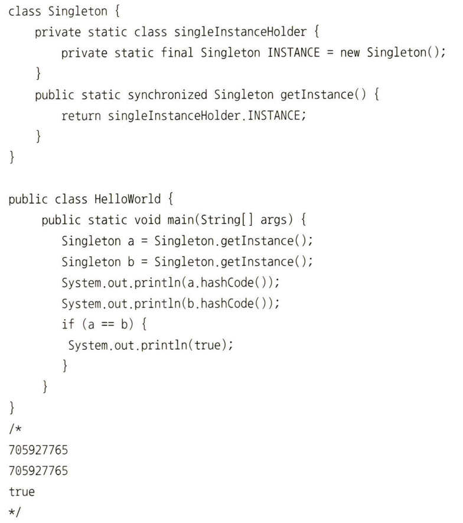

# 1장 디자인 패턴과 프로그래밍 패러다임

---

## 목차(9p)

### [1.1 디자인 패턴](https://github.com/Al9-Mor9/CS-study/blob/main/Ch01/ch01_H.md#11-%EB%94%94%EC%9E%90%EC%9D%B8-%ED%8C%A8%ED%84%B4-1)

### [1.2 프로그래밍 패러다임](https://github.com/Al9-Mor9/CS-study/blob/main/Ch01/ch01_H.md#12-%ED%94%84%EB%A1%9C%EA%B7%B8%EB%9E%98%EB%B0%8D-%ED%8C%A8%EB%9F%AC%EB%8B%A4%EC%9E%84-1)

### 예상 질문

---

# 1.1 디자인 패턴

디자인 패턴이랑 프로그램을 설계할 때 발생했던 문제점들을 객체 간의 상호 관계 등을 이용하여 해결할 수 있도록 하나의 ‘규약’ 형태로 만들어 놓은 것

## 1.1.1 싱글톤 패턴(singleton pattern)

- 하나의 클래스에 오직 하나의 인스턴스만 가지는 패턴
- 보통 데이터베이스 연결 모듈에 많이 사용
- 장점 - 인스턴스를 생성할 때 드는 비용이 줄어든다
- 단점 - 의존성이 높아짐
    
    ### 자바스크립트의 싱글톤 패턴
    
    ```jsx
    const obj = {
    	a: 27
    }
    const obj2 = {
    	a: 27
    }
    console.log(obj == obj2)
    //false
    ```
    
    - 자바스크립트에서 리터럴 또는 new Object로 객체를 생성하게 되면 다른 어떤 객체와도 같지 않기 때문에 이 자체만으로 싱글톤 패턴을 구현할 수 있다
    
    ### 데이터베이스 연결 모듈
    
    ```jsx
    const URL = 'mongodb://localhost:27017/kundoapp'
    const createConnection = url => ({"url" : url})
    class DB{
    	constructor(url){
    		if (!DB.instance){
    			DB.instance = createConnection(url)
    		}
    		return DB.instance
    	}
    	connect(){
    		return this.instance
    	}
    }
    
    const a = new DB(URL)
    const b = new DB(URL)
    console.log(a === b) // true
    ```
    
    - 위처럼 DB.instance라는 하나의 인스턴스를 기반으로 a, b를 생성하는 것을 볼 수 있음
        
        → 이를 통해 데이터베이스 연결에 관한 인스턴스 생성 비용을 아낄 수 있음
        
    
    ### 자바에서의 싱글톤 패턴
    
    
    
    ### mongoose의 싱글톤 패턴
    
    
    
    ### mySQL의 싱글톤 패턴
    
    
    
    ### 싱글톤 패턴의 단점
    
    - 싱글톤 패턴은 TDD(Test Driven Development)를 할 때 걸림돌이 됨
    
    ### 의존성 주입
    
    - 모듈간의 결합을 강하게 만들 수 있다는 단점 존재
        - 이 때, 의존성 주입(DI, Dependency Injection)을 통해 결합을 느슨하게 만들어 해결 가능
        
        
        
    - **의존성 주입의 장점**
        - 테스팅하기 쉽고 마이그레이션하기도 수월
        - 모듈간의 관계들이 조금 더 명확해짐
    - **의존성 주입의 단점**
        - 복잡성 증가
        - 약가의 런타임 패널티 발생
    - **의존성 주입 원칙**
        - “상위 모듈은 하위 모듈에서 어떠한 것도 가져오지 않아야 한다”
        - 둘 다 추상화에 의존해야 하며, 이 때 추상화는 세부 사항에 의존하지 말아야 한다.

## 1.1.2 팩토리 패턴

- 객체 생성 부분을 떼어내 추상화한 패턴이자 상속 관계에 있는 두 클래스에서 상위 클래스가 중요한 뼈대를 결정하고, 하위 클래스에서 객체 생성에 관한 구체적인 내용을 결정하는 패턴
- 상위 클래스와 하위 클래스가 분산 → 느슨한 결합을 가지며 상위 클래스에서는 인스턴스 생성방식에 대해 알 필요가 없으므로 더 많은 유연성을 가짐
- 코드를 리팩터링 하더라도 한 곳만 고칠 수 있게 되니 유지 보수성이 증가
    
    ### 자바스크립트의 팩토리 패턴
    
    간단하게 new Object()로 구현
    
    ```jsx
    const num = new Object(42)
    const str = new Object('abc')
    num.constructor.name; // number
    str.constructor.name; // String
    ```
    
    숫자를 전달하거나 문자열을 전달함에 따라 다른 타입의 객체를 생성
    
    = 전달 받은 값에 따라 다른 객체를 생성하며 인스턴스의 타입 등을 결정
    
    ```jsx
    class Latte{
      constructor(){
        this.name = "latte"
      }
    }
    class Espresso{
      constructor(){
        this.name = "Espresso"
      }
    }
    class LatteFactory{
      static createCoffee(){
        return new Latte()
      }
    }
    class EspressoFactory{
      static createCoffee(){
        return new Espresso()
      }
    }
    const factoryList = { LatteFactory, EspressoFactory }
    class CoffeeFactory{
      static createCoffee(type){
        const factory = factoryList[type]
        return factory.createCoffee()
      }
    }
    
    const main = () => {
      // 라떼 커피 주문
      const coffee = CoffeeFactory.createCoffee("LatteFactory")
      // 커피 이름을 부른다
      console.log(coffee.name) // latte
    }
    
    main()
    ```
    
    - CoffeeFactory라는 상위 클래스가 중요한 뼈대를 결정하고 하위 클래스인 LatteFactory가 구체적인 내용을 결정
    - 이는 의존성 주입이라고도 볼 수 있음. CoffeeFactory에서 LatteFactory의 인스턴스를 생성하는 것이 아닌 LatteFactory에서 생성한 인스턴스를 CoffeeFactory에 주입하고 있음

## 1.1.3 전략 패턴


전략 패턴(strategy pattern)은 객체의 행위를 바꾸고 싶을 때, 직접 수정하지 않고 전략이라 부르는 ‘캡슐화한 알고리즘’을 컨텍스트 안에서 바꿔주면서 상호 교체가 가능하게 만드는 패턴

### 자바의 전략 패턴

```java
//쇼핑 카트에 아이템을 담아 LUNACard 또는 KAKAOCard라는 두 개의 전략으로 결제하는 코드
import java.text.DecimalFormat;
import java.util.ArrayList;
import java.util.List;
interface PaymentStrategy { 
    public void pay(int amount);
} 

class KAKAOCardStrategy implements PaymentStrategy {
    private String name;
    private String cardNumber;
    private String cvv;
    private String dateOfExpiry;
    
    public KAKAOCardStrategy(String nm, String ccNum, String cvv, String expiryDate){
        this.name=nm;
        this.cardNumber=ccNum;
        this.cvv=cvv;
        this.dateOfExpiry=expiryDate;
    }

    @Override
    public void pay(int amount) {
        System.out.println(amount +" paid using KAKAOCard.");
    }
} 

class LUNACardStrategy implements PaymentStrategy {
    private String emailId;
    private String password;
    
    public LUNACardStrategy(String email, String pwd){
        this.emailId=email;
        this.password=pwd;
    }
    
    @Override
    public void pay(int amount) {
        System.out.println(amount + " paid using LUNACard.");
    }
} 

class Item { 
    private String name;
    private int price; 
    public Item(String name, int cost){
        this.name=name;
        this.price=cost;
    }

    public String getName() {
        return name;
    }

    public int getPrice() {
        return price;
    }
} 

class ShoppingCart { 
    List<Item> items;
    
    public ShoppingCart(){
        this.items=new ArrayList<Item>();
    }
    
    public void addItem(Item item){
        this.items.add(item);
    }
    
    public void removeItem(Item item){
        this.items.remove(item);
    }
    
    public int calculateTotal(){
        int sum = 0;
        for(Item item : items){
            sum += item.getPrice();
        }
        return sum;
    }
    
    public void pay(PaymentStrategy paymentMethod){
        int amount = calculateTotal();
        paymentMethod.pay(amount);
    }
}  

public class HelloWorld{
    public static void main(String []args){
        ShoppingCart cart = new ShoppingCart();
        
        Item A = new Item("kundolA",100);
        Item B = new Item("kundolB",300);
        
        cart.addItem(A);
        cart.addItem(B);
        
        // pay by LUNACard
        cart.pay(new LUNACardStrategy("kundol@example.com", "pukubababo"));
        // pay by KAKAOBank
        cart.pay(new KAKAOCardStrategy("Ju hongchul", "123456789", "123", "12/01"));
    }
}
/*
400 paid using LUNACard.
400 paid using KAKAOCard.
*/
```

## 1.1.4 옵저버 패턴(observer pattern)

- 주체가 어떤 객체(subject)의 상태 변화를 관찰하다가 상태 변화가 있을 때마다 메서드 등을 통해 옵저버 목록에 있는 옵저버들에게 변화를 알려주는 디자인 패턴
    - 주체 : 객체의 상태 변황를 보고 있는 관찰자
    - 옵저버 : 이 객체들의 상태 변화에 따라 전달되는 메서드 등을 기반으로 ‘추가 변화 사항’이 생기는 객체들
        - 객체와 주체가 분리되어 있는 옵저버 패턴
            
            
            
        - 객체와 주체가 합쳐진 옵저버 패턴
            
            
            
    
    ### 자바에서의 옵저버 패턴
    
    ```java
    // topic을 기반으로 한 옵저버 패턴
    // topic은 주체이자 객체
    import java.util.ArrayList;
    import java.util.List;
    
    interface Subject {
        public void register(Observer obj);
        public void unregister(Observer obj);
        public void notifyObservers();
        public Object getUpdate(Observer obj);
    }
    
    interface Observer {
        public void update(); 
    }
    
    class Topic implements Subject {
        private List<Observer> observers;
        private String message; 
    
        public Topic() {
            this.observers = new ArrayList<>();
            this.message = "";
        }
    
        @Override
        public void register(Observer obj) {
            if (!observers.contains(obj)) observers.add(obj); 
        }
    
        @Override
        public void unregister(Observer obj) {
            observers.remove(obj); 
        }
    
        @Override
        public void notifyObservers() {   
            this.observers.forEach(Observer::update); 
        }
    
        @Override
        public Object getUpdate(Observer obj) {
            return this.message;
        } 
        
        public void postMessage(String msg) {
            System.out.println("Message sended to Topic: " + msg);
            this.message = msg; 
            notifyObservers();
        }
    }
    
    class TopicSubscriber implements Observer {
        private String name;
        private Subject topic;
    
        public TopicSubscriber(String name, Subject topic) {
            this.name = name;
            this.topic = topic;
        }
    
        @Override
        public void update() {
            String msg = (String) topic.getUpdate(this); 
            System.out.println(name + ":: got message >> " + msg); 
        } 
    }
    
    public class HelloWorld { 
        public static void main(String[] args) {
            Topic topic = new Topic(); 
            Observer a = new TopicSubscriber("a", topic);
            Observer b = new TopicSubscriber("b", topic);
            Observer c = new TopicSubscriber("c", topic);
            topic.register(a);
            topic.register(b);
            topic.register(c); 
       
            topic.postMessage("amumu is op champion!!"); 
        }
    }
    /*
    Message sended to Topic: amumu is op champion!!
    a:: got message >> amumu is op champion!!
    b:: got message >> amumu is op champion!!
    c:: got message >> amumu is op champion!!
    */
    ```
    

## 1.1.5 프록시 패턴과 프록시 서버

- 프록시 객체 : 프록시 패턴이 녹아들어 있는 객체

### 프록시 패턴(proxy pattern)

- 대상 객체(subject)에 접근하기 전 그 접근에 대한 흐름을 가로채 대상 객체 앞단의 인터페이스 역할을 하는 디자인 패턴
    
    
    
- 이를 통해 객체의 속성, 변환 등을 보완하며 보안, 데이터 검증, 캐싱, 로깅에 사용
- 프록시 객체로 쓰이기도 하지만 프록시 서버로도 활용됨

### 프록시 서버(proxy server)

- 서버와 클라이언트 사이에서 클라이언트가 자신을 통해 다른 네트워크 서비스에 간접적으로 접속할 수 있게 해주는 컴퓨터 시스템이나 응용 프로그램

**프록시 서버로 쓰는 nginx**

- nginx : 비동기 이벤트 기반의 구조와 다수의 연결을 효과적으로 처리 가능한 웹 서버, 주로 Node.js 서버 앞단의 프록시 서버로 활용됨
    
    
    

**프록시 서버로 쓰는 CloudFare**

- CloudFare : 전 세계적으로 분산된 서버가 있고 이를 통해 어떠한 시스템의 콘텐츠 전달을 빠르게 할 수 있는 CDN 서비스
    
    
    
    - CDN : 지리적으로 분산된 여러 개의 서버
        - 웹 콘텐츠를 사용자와 가까운 곳에서 전송함으로써 전송 속도를 높임
        - 웹 페이지, 이미지, 비디오 등의 콘텐츠를 사용자의 물리적 위치와 가까운 프록시 서버에 캐싱
        - like ATM

**CORS와 프론트엔드의 프록시 서버**

- CORS(Cross-Origin Resource Sharing) : 서버가 웹 브라우저에서 리소스를 로드할 때 다른 오리진을 통해 로드하지 못하게 하는 HTTP 헤더 기반 메커니즘
    - 프록시  서버 이용 전
        
        
        
    - 프록시 서버 이용 후
        
        
        

## 1.1.6 이터레이터 패턴(iterator pattern)

- 이터레이터(iterator)를 사용하여 컬렉션(collection)의 요소들에 접근하는 디자인 패턴
- 순회할 수 있는 여러 자료형의 구조와 상관없이 이터레이터라는 하나의 인터페이스로 순회 가능
    
    
    
    ### 자바스크립트에서의 이터레이터 패턴
    
    ```jsx
    const mp = new Map() 
    mp.set('a', 1)
    mp.set('b', 2)
    mp.set('cccc', 3) 
    const st = new Set() 
    st.add(1)
    st.add(2)
    st.add(3) 
    const a = []
    for(let i = 0; i < 10; i++)a.push(i)
    
    for(let aa of a) console.log(aa)
    for(let a of mp) console.log(a)
    for(let a of st) console.log(a) 
    /* 
    a, b, c 
    [ 'a', 1 ]
    [ 'b', 2 ]
    [ 'c', 3 ]
    1
    2
    3
    */
    ```
    

## 1.1.7 노출모듈 패턴(revealing module pattern)

- 즉시 실행 함수를 통해 private, public 같은 접근 제어자를 만드는 패턴.
- 자바스크립트는 private나 public 같은 접근 제어자가 존재하지 않고 전역범위에서 스크립트가 실행되기 때문에 노출 모듈 패턴을 통해 private와 public 접근 제어자를 구현함
    
    ### 자바스크립트에서의 노출모듈 패턴
    
    ```jsx
    const pukuba = (() => {
        const a = 1
        const b = () => 2
        const public = {
            c : 2, 
            d : () => 3
        }
        return public 
    })() 
    console.log(pukuba)
    console.log(pukuba.a)
    // { c: 2, d: [Function: d] }
    // undefined
    ```
    
    - a와 b는 다른 모듈에서 사용할 수 없는 변수나 함수, private
    - c와 d는 다른 모듈에서 사용할 수 있는 변수 / 함수, public
    - 앞서 설명한 노출모듈 패턴을 기반으로 만든 자바스크립트 모듈방식으로는 CJS(CommonJS) 모듈방식 존재

## 1.1.8 MVC 패턴

- Model, View, Controller로 이루어진 디자인 패턴
    
    
    
- 애플리케이션의 구성요소를 세 가지 역할로 구분하여 개발 프로세스에서 각각의 구성 요소에만 집중해서 개발 가능
- 재사용성과 확장성이 용이
- 애플리케이션이 복잡해질수록 모델과 뷰의 관계가 복잡해짐

### 모델(model)

- 애플리케이션의 데이터인 데이터베이스, 상수, 변수 등을 의미
- 사각형 모양의 박스 안에 글자가 있다면 그 사각형 모양의 박스 위치 정보, 글자 내용, 글자 위치, 글자 포맷(utf-8)에 관한 정보를 모두 가지고 있어야 함

### 뷰(view)

- inputbox, checkbox, textarea 등 사용자 인터페이스 요소를 나타냄
- 모델을 기반으로 사용자가 볼 수 있는 화면
- 모델이 가지고 있는 정보를 다로 저장하지 않아야 하며 단순 사각형 모양 등 화면에 표시하는 정보만 가지고 있어야 함
- 변경이 일어나면 컨트롤러에게 전달

### 컨트롤러(controller)

- 하나 이상의 모델과 하나 이상의 뷰를 잇는 다리 역할을 하며 이벤트 등 메인 로직 담당
- 모델과 뷰의 생명 주기 관리
- 모델이나 뷰의 변경 통지를 받으면 이를 해석하여 각각의 구성요소에 해당 내용에 대해 알려줌

## 1.1.9 MVP 패턴

- MVC 패턴에서 파생되었으며 MVC에서 C에 해당하는 컨트롤러가 프레젠터(presenter)로 교체된 패턴
    
    
    
- 뷰와 프레젠터는 일대일 관계이기 때문에 MVC 패턴보다 더 강한 결합을 지닌 디자인 패턴

## 1.1.10 MVVM 패턴

- MVC의 C에 해당하는 컨트롤러가 뷰 모델(view model)로 바뀐 패턴
    - 뷰 모델 : 뷰를 더 추상화한 계층
    
    
    
- MVVM 패턴은 MVC 패턴과 다르게 커맨드와 데이터 바인딩을 가짐
- 뷰와 뷰 모델 사이의 양방향 데이터가 바인딩을 지원하며 UI를 별도의 코드 수정 없이 재사용 가능하며 단위 테스팅 하기 쉬움

### MVVM 패턴 예 : Vue.js

- Vue.js : 반응형(reactivity)이 특징인 프론트엔드 프레임워크
    - 함수를 사용하지 않고 값 대입만으로도 변수가 변경되며 양방향 바인딩, html을 토대로 컴포넌트를 구축할 수 있음

---

# 1.2 프로그래밍 패러다임

프로그래밍 패러다임(programming paradigm) : 프로그래머에게 프로그래밍의 관점을 갖게 해주는 개발 방법론


## 1.2.1 선언형과 함수형 프로그래밍(declarative programming)

- 무엇을 풀어내는가에 집중하는 패러다임
- “프로그램은 함수로 이루어진 것이다”라는 명제가 담긴 패러다임
- 함수형 패러다임(functional programming)은 선언형 패러다임의 일종
    - 예
        
        ```jsx
        const ret = [1,2,3,4,5,11,12]
        .reduce((max, num) => num > max ? num : max, 0)
        console.log(ret)  // 12
        ```
        
        - reduce()는 배열만 받아서 누적한 결괏값을 반환하는 순수 함수
    - 작은 ‘순수 함수’들을 블록처럼 쌓아 로직을 구현하고 ‘고차 함수’를 통해 재사용성을 높인 프로그래밍 패러다임
    - 순수 함수
        - 출력이 입력에만 의존하는 것
            
            ```jsx
            const pure = (a, b) => {
              return a + b
            }
            ```
            
    - 고차 함수
        - 함수가 함수를 값처럼 매개변수로 받아 로직을 생성할 수 있는 것

## 1.2.2 객체지향 프로그래밍(OOP : Object-Oriented Programming)

- 객체들의 집합으로 프로그램의 상호 작용을 표현하며 데이터를 객체로 취급하여 객체 내부에 선언된 메서드를 활용하는 방식
- 설계에 많은 시간 소요, 처리 속도가 느린편
    
    ```jsx
    const ret = [1, 2, 3, 4, 5, 11, 12]
    class List {
        constructor(list) {
            this.list = list
            this.mx = list.reduce((max, num) => num > max ? num : max, 0)
        }
        getMax() {
            return this.mx
        }
    }
    const a = new List(ret)
    console.log(a.getMax()) // 12
    ```
    

### 객체지향 프로그래밍의 특징

- 추상화, 캡슐화, 상속성, 다형성

**추상화(abstraction)**

- 복잡한 시스템으로부터 핵심적인 개념 또는 기능을 간추려내는 것

**캡슐화(encapsulation)**

- 객체의 속성과 메서드를 하나로 묶고 일부를 외부에 감추어 은닉하는 것

**상속성(inheritance)**

- 상위 클래스의 특성을 하위 클래스가 이어받아서 재사용하거나 추가, 확장하는 것
- 코드의 재사용 측면, 계층적 관계 생성, 유지 보수성 측면에서 중요함

**다형성(polymorphism)**

- 하나의 메서드나 클래스가 다양한 방법으로 동작하는 것
- 오버로딩 / 오버라이딩 등
- 오버로딩(overloading)
    - 같은 이름을 가진 메서드를 여러 개 두는 것
        
        ```java
        class Person {
        
            public void eat(String a) {
                System.out.println("I eat " + a);
            }
        
            public void eat(String a, String b) {
                System.out.println("I eat " + a + " and " + b);
            }
        }
        
        public class CalculateArea {
        
            public static void main(String[] args) {
                Person a = new Person();
                a.eat("apple");
                a.eat("tomato", "phodo");
            }
        }
        /*
        I eat apple
        I eat tomato and phodo
        */
        ```
        
- 오버라이딩(overriding)
    - 주로 메서드 오버라이딩(method overriding)을 말하며 상위 클래스로부터 상속받은 하위 클래스가 재정의하는 것
        
        ```java
        class Animal {
            public void bark() {
                System.out.println("mumu! mumu!");
            }
        }
        
        class Dog extends Animal {
            @Override
            public void bark() {
                System.out.println("wal!!! wal!!!");
            }
        }
        
        public class Main {
            public static void main(String[] args) {
                Dog d = new Dog();
                d.bark();
            }
        }
        /*
        wal!!! wal!!!
        */
        ```
        

### 설계 원칙

객체지향 프로그래밍을 설계할 때는 SOLID 원칙 준수

- S : 단일 책임 원칙(SRP : Single Responsibility Principle)
    - 모든 클래스는 각각 하나의 책임만 가져야 하는 원칙
- O : 개방 - 폐쇄 원칙(OCP : Open Closed Principle)
    - 유지 보수 사항이 생긴다면 코드를 쉽게 확장할 수 있도록 하고 수정할 때는 닫혀 있어야 하는 원칙
- L : 리스코프 치환 원칙(LSP : Liskov Subtitution Principle)
    - 프로그램의 객체는 프로그램의 정확성을 깨뜨리지 않으면서 하위 타입의 인스턴스로 바꿀 수 있어야 하는 것
    - 클래스는 상속이 되기 마련이고 부모, 자식이라는 계층관계가 형성되는데, 이때 부모 객체에 자식 객체를 넣어도 시스템이 문제없이 돌아가게 만드는 것
- I : 인터페이스 분리 원칙(ISP : Interfacace Segregation Principle)
    - 하나의 일반적인 인터페이스보다 구체적인 여러 개의 인터페이스를 만들어야 하는 원칙
- D : 의존 역전 원칙(DIP : Dependency Inversion Principle)
    - 자신보다 변하기 쉬운 것에 의존하던 것을 추상화된 인터페이스나 상위 클래스를 두어 변하기 쉬운 것의 변화에 영향을 받지 않게 하는 원칙
    - 상위 계층은 하위 계층의 변화에 대한 구현으로부터 독립해야 함

## 1.2.3 절차형 프로그래밍

- 로직이 수행되어야 할 연속적인 계산 과정으로 구성
- 일이 진행되는 방식으로 그저 코드를 구현하기만 하면 되기 때문에 코드의 가독성이 좋으며 실행속도가 빠름
- 포트란(fortran)을 이용한 대기 과학 관련 연산작업, 머신러닝의 배치 작업 등
- 모듈화가 어렵고 유지보수성이 떨어짐
