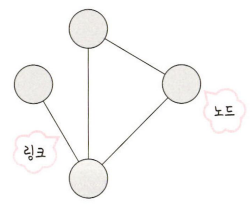

# 2장 네트워크

### 목차

# 2.1 네트워크의 기초

- 노드(node)와 링크(link)가 서로 연결되어 있거나 연결되어 있지 않은 집합체를 의미
    
    
    
    - 노드 : 서버, 라우터, 스위치 등 네트워크 장치를 의미
    - 링크 : 유선 또는 무선

## 2.1.1 처리량과 지연시간

- 좋은 네트워크 : 많은 처리량을 처리할 수 있으며 지연 시간이 짧고 장애 빈도가 적으며 좋은 보안을 갖춘 네트워크

### 처리량(throughput)

- 링크를 통해 전달되는 시간당 데이터 양
    
    
    
- 단위 : bps(bits per second)
- 처리량은 사용자들이 많이 접속할 때마다 커지는 트래픽, 네트워크 장치 간의 대역폭, 네트워크 중간에 발생하는 에러, 장치의 하드웨어 스펙에 영향을 받음

### 지연시간(latency)

- 요청이 처리되는  시간
- 어떤 메시지가 두 장치 사이를 왕복하는 데 걸린 시간
    
    
    
- 매체 타입(유선, 무선), 패킷 크기, 라우터의 패킷 처리 시간에 영향을 받음

## 2.1.2 네트워크 토폴로지와 병목현상

### 네트워크 토폴로지

- 노드와 링크가 어떻게 배치되어 있는지에 대한 방식이자 연결 형태를 의미

**트리 토폴로지**

- 계층형 토폴로지라고 하며 트리 형태로 배치한 네트워크 구성을 말함
    
    
    
- 노드의 추가, 삭제가 쉬우며 특정 노드에 트래픽이 집중될 때 하위 노드에 영향을 끼칠 수 있음

**버스 토폴로지**

- 중앙 통신 회선 하나에 여러 개의 노드가 연결되어 공유하는 네트워크 구성을 말하며 근거리 통신망(LAN)에서 사용
    
    
    
- 설치 비용이 적고 신뢰성이 우수하며 중앙 통신 회선에 노드를 추가하거나 삭제할 수 있음
- 스푸핑이 가능한 문제점
    - LAN 상에서 송신부의 패킷을 송신과 관련없는 다른 호스트에 가지 않도록 하는 스위칭 기능을 마비시키거나 속여서 특정 노드에 해당 패킷이 오도록 처리하는 것
    
    
    

**스타 토폴로지**

- 중앙에 있는 노드에 모두 연결된 네트워크 구성
    
    
    
- 노드를 추가하거나 에러를 탐지하기 쉽고 패킷의 충돌 발생 가능성이 적음
- 어떠한 노드에 장애가 발생해도 쉽게 에러를 발견할 수 있으며 장애 노드가 중앙 노드가 아닐 경우 다른 노드에 영향을 끼치는 것이 적음.
- 중앙 노드에 장애가 발생하면 전체 네트워크를 사용할 수 없고 설치비용이 고가

**링형 토폴로지**

- 각각의 노드가 양 옆의 두 노드와 연결하여 전체적으로 고리처럼 하나의 연속된 길을 통해 통신을 하는 망 구성방식
    
    
    
- 데이터는 노드에서 노드로 이동을 하며, 각각의 노드는 고리 모양의 길을 통해 패킷을 처리
- 노드의 수가 증가되어도 네트워크상의 손실이 거의 없음
- 충돌이 발생되는 가능성이 적음
- 노드의 고장 발견을 쉽게 찾을 수 있음
- 네트워크 구성 변경이 어렵고 회선에 장애 발생 시 네트워크 전체에 영향을 크게 끼칠 수 있음

**메시 토폴로지**

- 망형 토폴로지라고도 하며 그물망처럼 연결된 구조
    
    
    
- 한 단말 장치에 장애가 발생해도 여러 개의 경로가 존재하므로 네트워크를 계속 사용할 수 있고 트래픽도 분산 처리가 가능함
- 노드의 추가가 어렵고 구축 비용과 운용 비용이 고가

**병목현상**

- 토폴로지(네트워크 구조)는 병목현상을 찾을 때 중요한 기준

## 2.1.3 네트워크 분류

- LAN : Local Area Network : 사무실과 개인적으로 소유 가능한 규모
- MAN : Metropolitian Area Network : 서울시 등 시 정도 규모
- WAN : Wide Area Network : 세계 규모

### LAN

- 근거리 통신망을 의미하며 같은 건물이나 캠퍼스 같은 좁은 공간에서 운영
- 전송 속도가 빠르고 혼잡하지 않다

### MAN

- 대도시 지역 네트워크를 나타냄, 도시 같은 넓은 지역에서 운영
- 전송 속도는 평균이며, LAN보다는 더 혼잡한 편

### WAN

- 광역 네트워크를 의미하며 국가 또는 대륙 같은 더 넓은 지역에서 운영
- 전송 속도는 낮으며, MAN보다는 더 혼잡한 편

## 2.1.4 네트워크 성능 분석 명령어

- 네트워크 병목현상의 주 원인
    - 네트워크 대역폭
    - 네트워크 토폴로지
    - 서버 CPU, 메모리 사용량
    - 비효율적인 네트워크 구성
- 이 때는 네트워크 관련 테승트와 무관한 테스트를 통해 ‘네트워크로부터 발생한 문제점’ 인지 확인 후 네트워크 성능 분석을 해야 함

### ping(Packet INternet Groper)

- 네트워크 상태를 확인하려는 대상 노드를 향해 일정 크기의 패킷을 전송하는 명령어
- 이를 통해 해당 노드까지 네트워크가 잘 연결되어 있는지 확인할 수 있음
- TCP/IP 중 ICMP를 통해 동작하며, 이 때문에 ICMP(네트워크 장치에서 네트워크 통신 문제를 진단하는 데 사용하는 네트워크 계층 프로토콜)를 지원하지 않는 기기를 대상으로는 실행 불가능
- 내집에서 내폰 ping 확인 - 휴대폰 IPv4 입력
    
    
    

### netstat

- 접속되어 있는 서비스들의 네트워크 상태를 표시하는 데 사용
- 네트워크 접속, 라우팅 테이블, 네트워크 프로토콜 등 리스트를 보여줌
- 주로 서비스의 포트가 열려 있는지 확인할 때 사용
    
    
    
- 이를 통해 접속중인 사이트 등에 대한 네트워크 상태 리스트를 볼 수 있음

### nslookup

- DNS에 관련된 내용을 확인하기 위해 쓰는 명령어
- 특정 도메인에 매핑된 IP를 확인하기 위해 사용
    
    
    

### tracert

- 윈도우에서는 tracert, 리눅스에서는 traceroute라는 명령어로 구동
- 목적지 노드까지 네트워크 경로를 확인할 때 사용하는 명령어
- 목적지 노드까지 구간들 중 어느 구간에서 응답 시간이 느려지는지 등을 확인할 수 있음
    
    
    
- 이 외에도 ftp를 통해 대형 파일을 전송하여 테스팅하거나 tcpdump를 통해 노드로 오고 가는 패킷을 캡처하는 등의 명령어 존재

## 2.1.5 네트워크 프로토콜 표준화

- 다른 장치들끼리 데이터를 주고받기 위해 설정된 공통된 인터페이스
- 이러한 프로토콜은 기업이나 개인이 발표해서 정하는 것이 아니라 IEEE 또는 IETF라는 표준화 단체가 이를 정함
    
    
    
    ### IEEE 802.3
    
    - 이더넷에서 물리 계층, 데이터 링크 계층의 매체 접근 제어를 정의하는 워킹 그룹(Working group)이 제작한 표준 집합.
        - 광역 통신망 기술에도 활용되지만, 일반적으로 근거리 통신망 기술
        - 물리 연결은 동축 케이블과 광케이블 등 다양한 형태의 케이블을 통해 노드와 인프라스트럭쳐 장치(허브, 스위치, 라우터)
- 예) 웹을 접속할 때 쓰이는 HTTP - ‘서로 약속된’ 인터페이스인 HTTP라는 프로토콜을 통해 노드들은 웹 서비스를 기반으로 데이터를 주고 받을 수 있음

---

# 2.2 TCP/IP 4 계층 모델

### **Transmission Control Protocol/Internet Protocol**

- 컴퓨터 사이의 통신 표준 및 네트워크의 라우팅 및 상호연결에 대한 자세한 규칙을 지정하는 프로토콜의 집합
- 네트워크에 연결된 여러 컴퓨터(호스트) 사이의 통신을 허용
- TCP/IP는 하드웨어에 구애받지 않는다는 장점을 가진다
- 인터넷 프로토콜이 전송 단위를 정의하고 해당 전송 방법을 지정하기 때문에 정보를 연결하고 교환하는 많은 유형의 네트워크 기술을 허용하며, 네트워크 하드웨어의 세부사항들을 숨길 수 있음
- 이 책에서는 4계층 모델로 설명하며 네트워크에서 사용되는 통신 프로토콜의 집합으로 계층들은 프로토콜의 네트워킹 범위에 따라 네 개의 추상화 계층으로 구성

## 2.2.1 계층 구조

TCP/IP 계층은 네 개의 계층을 가지고 있으며 OSI 7계층과 많이 비교한다.


- 위 계층들은 특정 계층이 변경되었을 때 다른 계층이 영향을 받지 않도록 설계되었다.
    - ex) 전송 계층에서 TCP를 UDP로 변경했다고 해서 인터넷 웹 브라우저를 다시 설치해야 하는 것은 아님

### 애플리케이션 계층

- FTP, HTTP, SSH, SMTP, DNS 등 응용 프로그램이 사용되는 프로토콜 계층이며 웹 서비스, 이메일 등 서비스를 실질적으로 사람들에게 제공하는 층
- **FTP**(File Transfer Protocol : 파일 전송 프로토콜)
    - 장치와 장치 간의 파일을 전송하는 데 사용되는 표준 통신 프로토콜
    - TCP/IP 네트워크 상에서 컴퓨터들이 파일을 교환하기 위해 1971년에 최초로 공개된 통신 규약
    - 파생형으로 FTPS(TLS 프로토콜이 적용됨)와 SFTP(SSH 프로토콜 기반, FTP와 기술적인 연관성은 전혀 없음)가 있다
        - [TLS](https://www.ibm.com/docs/ko/ibm-mq/9.1?topic=mechanisms-cryptographic-security-protocols-tls)(Transport Layer Security)
            - 두 당사자가 서로를 식별하고 인증하며 기밀성 및 데이터 무결성과 통신 할 수 있도록 함
        - [SFTP](https://ko.wikipedia.org/wiki/SSH_%ED%8C%8C%EC%9D%BC_%EC%A0%84%EC%86%A1_%ED%94%84%EB%A1%9C%ED%86%A0%EC%BD%9C)(SSH File Transfer Protocol : SSH 파일 전송 프로토콜 또는 Secure File Transfer Protocol : 보안 파일 전송 프로토콜)
            - 신뢰할 수 있는 데이터 스트림을 통해 파일 접근, 파일 전송, 파일 관리를 제공하는 네트워크 프로토콜
- **[SSH](https://limvo.tistory.com/21)**(Secure SHell : 보안 셸)
    - 원격 호스트에 접속하기 위해 사용되는 보안 프로토콜
    - 보안되지 않은 네트워크에서 네트워크 서비스를 안전하게 운영하기 위한 암호화 네트워크 프로토콜
    - 일반적인 사용 용도
        - 원격 접속 사용자 및 자동화 프로세스의 접근 시
        - 자동화된 파일 전송 시
        - 원격 명령 실행 시
        - 네트워크 인프라와 중요 시스템 관리 시
    - 작동원리
        - SH 프로토콜은 클라이언트-서버 모델로 동작하며 대칭키 방식, 비대칭키 방식, 해시 알고리즘을 사용하여 인증 및 암호화를 수행한다.
        - 대칭키 방식은 클라이언트-서버 간 전체 연결을 암호화에 사용되며,비대칭키 방식은 키 교환, 클라이언트 인증, 서버 인증에 사용되고,해시 알고리즘은 패킷의 무결성을 확인하기 위해 사용된다.
        
        
        
- **[HTTP](https://shlee0882.tistory.com/107)**(Hypertext Transfer Protocol)
    - World Wide Web을 위한 데이터 통신의 기초이자 웹 사이트를 이용하는 데 쓰는 프로토콜
    - 사용자가 웹 사이트를 방문하면 사용자 브라우저가 웹 서버에 HTTP 요청을 전송하고 웹 서버는 HTTP 응답으로 응답한다
    - 인터넷 상에서 데이터를 주고 받기 위한 **서버/클라이언트 모델**을 따르는 프로토콜
        - 애플리케이션 레벨의 프로토콜로 **TCP/IP위에서 작동**한다.
        - HTTP는 **어떤 종류의 데이터든지 전송**할 수 있도록 설계돼 있다.
        - HTTP로 보낼 수 있는 데이터는 **HTML문서, 이미지, 동영상, 오디오, 텍스트 문서** 등 여러종류가 있다.
        - 하이퍼텍스트 기반으로(Hypertext) 데이터를 전송하겠다(Transfer) = **링크기반으로 데이터에 접속**하겠다는 의미
        - 작동방식([https://shlee0882.tistory.com/107](https://shlee0882.tistory.com/107))
    - 비연결성, 무상태 ([https://victorydntmd.tistory.com/286](https://victorydntmd.tistory.com/286))
- **SMTP**(Simple Mail Transfer Protocol)
    - 인터넷에서 이메일을 보내기 위해 이용되는 프로토콜
    - 특징
        - 텍스트 기반 프로토콜
        - 프로토콜은 TCP(SSL/TLS)
        - SMTP 서버와 클라이언트로 구성
    - 예시([https://mutpp.tistory.com/4](https://mutpp.tistory.com/4))
- **DNS**(Domain Name System)
    - 우리가 입력한 도메인 주소(URL)를 숫자인 IP 주소로 변환하는 과정이 필요한데 이것을 담당하는 시스템
    - 예시([https://ja-gamma.tistory.com/entry/DNS개념동작원리](https://ja-gamma.tistory.com/entry/DNS%EA%B0%9C%EB%85%90%EB%8F%99%EC%9E%91%EC%9B%90%EB%A6%AC))

### 전송 계층

전송(transport) 계층

- 송신자와 수신자를 연결하는 통신 서비스를 제공
- 연결 지향 데이터 스트림 지원, 신뢰성, 흐름 제어를 제공
- 애플리케이션과 인터넷 계층 사이의 데이터가 전달될 때의 중계역할을 수행.
- 예로는 TCP, UDP 등

TCP

- 패킷 사이의 순서를 보장하고 연결지향 프로토콜을 사용해 연결하여 신뢰성을 구축해서 수신여부를 확인
- ‘가상회선 패킷 교환 방식’ 을 사용

UDP

- 순서를 보장하지 않고 수신 여부를 확인하지 않음
- 단순히 데이터만 주는 ‘데이터그램 패킷 교환 방식’을 사용

**가상회선 패킷 교환 방식**

- 각 패킷에는 가상회선 식별자가 포함되며 모든 패킷을 전송하면 가상회선이 해제되고 패킷들은 전송된 ‘순서대로’ 도착하는 방식
    
    
    
    - 3, 2, 1로 이루어진 패킷이 어떠한 회선을 따라 순서대로 도착함

**데이터그램 패킷 교환 방식**

- 패킷이 독립적으로 이동하며 최적의 경로를 선택하여 가는데, 하나의 메시지에서 분할된 여러 패킷은 서로 다른 경로로 전송될 수 있으며 도착한 ‘순서가 다를 수’ 있는 방식을 뜻함
    
    
    
    - 3, 2, 1로 이루어진 패킷이 순서도 다르고 어떠한 회선을 중심으로 가는 것이 아니라 따로따로 이동하며 순서도 다르게 도착함

**TCP 연결 성립 과정**

TCP는 신뢰성을 확보할 때 ‘3-웨이 핸드셰이크(3-way handshake)’라는 작업을 진행

- 핸드셰이크
    - 정상적인 통신이 시작되기 전에 두 개의 실체 간에 확립된 통신 채널의 변수를 동적으로 설정하는 자동화된 협상 과정
    
    ---
    
    
    
    ```markdown
    - SYN
    	- SYNchronization의 약자, 연결 요청 플래그
    - ACK
    	- ACKnowledgement의 약자, 응답 플래그
    - ISN
    	- Initial Sequence Number의 약어
    	- 초기 네트워크 연결을 할 때 할당된 32비트 고유 시퀀스 번호
    ```
    
    1. SYN 단계
        - 클라이언트는 서버에 클라이언트의 ISN을 담아 SYN을 전송.
        - ISN은 새로운 TCP 연결의 첫 번째 패킷에 할당된 임의의 시퀀스 번호를 말함
    2. SYN + ACK 단계
        - 서버는 클라이언트의 SYN을 수신하고 서버의 ISN을 보내며 승인번호로 클라이언트의 ISN + 1을 보냄
    3. ACK 단계
        - 클라이언트는 서버의 ISN + 1 한 값인 승인번호를 담아 ACK를 서버에 보냄
    
    이렇게 3-웨이 핸드셰이크 과정 이후 신뢰성이 구축되고 데이터 전송을 시작.
    
    TCP는 이 과정이 있기 때문에 신뢰성이 있는 계층이라고 하며, UDP는 이 과정이 없어서 신뢰성이 없는 계층이라 한다.
    

**TCP 연결 해제 과정**

TCP가 연결을 해제할 때는 4-웨이 핸드셰이크(4-way handshake)과정이 발생


1. FIN으로 설정된 세그먼트 전송, 클라이언트는 FIN_WAIT_1 상태로 돌입, 이후 서버 응답 대기
2. 서버는 클라이언트로 ACK라는 승인 세그먼트 전송, 이후 CLOSE_WAIT 상태에 돌입.
    - 클라이언트가 세그먼트를 받으면 FIN_WAIT_2 상태에 돌입
3. 서버는 ACK를 보내고 일정 시간 후에 클라이언트에 FIN이라는 세그먼트를 전송
4. 클라이언트는 TIME_WAIT 상태가 되고 다시 서버로 ACK를 보내서 서버는 CLOSED 상태로 돌입.
    - 이후 클라이언트는 어느 정도의 시간을 대기한 후 연결이 닫히고 클라이언트와 서버의 모든 자원의 연결이 해제됨
- TIME_WAIT를 하는 이유
    - 지연 패킷이 발생할 경우를 대비
    - 두 장치가 연결이 닫혔는지 확인하기 위함.
        - LAST_ACK 상태에서 닫히게 되면 다시 새로운 연결을 하려고 할 때 장치는 계속 LAST_ACK 단계이기 때문에 접속 오류 발생

### **인터넷 계층**

- 장치로부터 받은 네트워크 패킷을 IP 주소로 지정된 목적지로 전송하기 위해 사용되는 계층
- IP, ARP, ICMP 등이 있음
- 패킷을 수 신해야 할 상대의 주소를 지정하여 데이터를 전달.
- 상대방이 제대로 받았는지에 대해 보장하지 않는 비연결적인 특징

### 링크 계층

- 전선, 광섬유, 무선 등으로 실질적으로 데이터를 전달하며 장치 간에 신호를 주고받는 ‘규칙’을 정하는 계층
- 이를 물리 계층과 데이터 링크 계층으로 나누기도 하는데 물리 계층은 무선 LAN과 유선 LAN을 통해 0과 1로 이루어진 데이터를 보내는 계층을 의미, 데이터 링크 계층은 ‘이더넷 프레임’을 통해 에러 확인, 흐름 제어, 접근 제어를 담당

**유선 LAN(IEEE802.3)**

유선 LAN을 이루는 이더넷은 IEEE802.3이라는 프로토콜을 따르며 전이중화 통신을 사용

전이중화 통신(full duplex)


- 양쪽 장치가 동시에 송수신할 수 있는 방식
- 송신로와 수신로를 나눠서 데이터를 주고 받으며 현대의 고속 이더넷은 이 방식을 기반함

CSMA / CD

- 이전에는 ‘반이중화 통신’ 중 하나인 CSMA / CD(Carrier Sense Multiple Access with Collision Detection) 방식을 썼음.
- 데이터를 보낸 이후 충돌이 발생한다면 일정 시간 이후 재전송하는 방식
- 수신로와 송신로를 한 경로를 기반으로 데이터를 전송

트위스트 페어 케이블

- 하나의 케이블처럼 보이지만 실제로는 여덟개의 구리선을 두 개씩 꼬아서 묶은 케이블
    
    
    

광섬유 케이블


- 레이저를 이용한 통신을 사용
- 장거리 및 고속 통신 가능
- 보통 100Gbps의 데이터를 전송
- 굴절률이 높은 부분을 코어, 낮은부분을 클래딩이라 부름
    
    
    
- 30°이상 꺾이면 속도 저하, 45° 이상 꺾이면 전송 안됨 ⇒ 동축케이블처럼 고정시키는게 일반적
- 해저 케이블에 주로 사용
    
    
    

**무선 LAN(IEEE802.11)**

수신과 송신에 같은 채널을 사용하기 때문에 반이중화 통신 사용

- 반이중화 통신(half duplex)
    
    
    
    - 서로 통신할 수는 있지만 동시에는 통신할 수 없으며 한 번에 한 방향만 통신할 수 있는 방식

CSMA / CA

- 반 이중화 통신 중 하나로 장치에서 데이터를 보내기 전 캐리어 감지 등으로 사전에 가능한 한 충돌을 방지하는 방식을 사용
    1. 데이터를 송신하기 전 무선 매체를 살핌
    2. 캐리어 감지 : 회선이 비어있는지 판단
    3. IFS(Inter FrameSpace) : 랜덤 값을 기반으로 정해진 시간만큼 기다리며, 무선 매체가 사용중이면 점차 그 간격을 늘리며 기다림
    4. 이후 데이터 송신

**무선 LAN(WLAN : Wireless Local Area Network)을 이루는 주파수**

- 무선 신호 전달방식을 이용하여 2대 이상의 장치를 연결하는 기술
- 매체인 공기에 주파수를 쏘아 무선 통신망을 구축
- 주파수 대역 : 2.4GHz 또는 5GHz 사용
    - 2.4 GHz : 장에물에 강하지만 간섭이 많음
    - 5 GHz : 채널 수도 많고 동시에 사용가능

와이파이

- 전자기기들이 무선 LAN 신호에 연결할 수 있게 하는 기술
- 무선 접속장치(AP : Access Point (ex : WIFI 라우터))가 필요함
- AP를 통해 유선 LAN에 흐르는 신호를 무선 LAN 신호로 변환
- 지그비, 블루투스 등 무선LAN을 이용한 기술은 또 많음

BSS(Basic Service Set)

- 기본 서비스 집합을 의미
- 동일 BSS 내에 있는 AP들과 장치들이 서로 통신이 가능한 구조를 의미함
- 근거리 무선 통신을 제공, 하나의 AP만을 기반으로 구축이 되어 있어 사용자가 한 곳에서 다른 곳으로 자유롭게 이동하며 네트워크에 접속하는 것은 불가능

ESS(Extended Service Set)

- 하나 이상의 연결된 BSS 그룹
- 장거리 무선통신을 제공하며 BSS보다 더 많은 가용성과 이동성을 지원
- 사용자는 이동하며 중단없이 네트워크 연결이 가능함

[참고] BSS, ESS


이더넷 프레임

- 정의 : 네트워킹의 한 방식으로 CSMA / CD라는 프로토콜을 사용한 통신 방식
- 데이터 링크 계층은 이더넷 프레임을 통해 전달받은 데이터의 에러를 검출하고 캡슐화 하며 다음과 같은 구조를 가짐
    
    
    
    - Preamble
        - 이더넷 프레임의 시작을 알림
    - SFD(Start Frame Delimiter)
        - 다음 바이트부터 MAC 주소 필드가 시작됨을 알림
            - MAC 주소 : 컴퓨터나 노트북 등 각 장치에서 네트워크에 연결하기 위한 장치를 구별하는 식별번호
    - DMAC, SMAC
        - 송신, 수신 MAC 주소를 말함
    - EtherType
        - 데이터 계층 위의 계층인 IP 프로토콜을 정의(IPv4 또는 IPv6 등등)
    - Payload
        - 전달받은 데이터
    - CRC
        - 에러 확인 비트

### 계층간 데이터 송수신 과정

- HTTP를 통해 웹 서버에 있는 데이터를 요청하면?
    
    
    
    - 요청 값들이 캡슐화 과정을 거쳐 전달되고, 다시 링크계층을 통해 해당 서버와 통신을 진행하고, 해당 서버의 링크 계층으로부터 애플리케이션까지 비캡슐화 과정을 거쳐 데이터가 전송됨

**캡슐화 과정**

- 상위 계층의 헤더와 데이터를 하위 계층의 데이터 부분에 포함시키고 해당 계층의 헤더를 삽입하는 과정
    
    
    
    - 애플리케이션 계층의 데이터가 전송 계층으로 전달되면서 ‘세그먼트’ 또는 ‘데이터그램’화 되며 TCP(L4) 헤더가 붙음
    - 이후 인터넷 계층으로 가면서 IP(L3)헤더가 붙으며 ‘패킷’화가 되고
    - 이후 링크 계층으로 전달되면서 프레임 헤더와 프레임 트레일러가 붙어 ‘프레임’화가 됨

**비캡슐화 과정**

- 하위 계층에서 상위 계층으로 가며 각 계층의 헤더 부분을 제거하는 과정
    
    
    
    - 링크 계층부터 타고 올라오면서 프레임화 된  데이터는 다시 패킷화를 거쳐 세그먼트, 데이터 그램화를 거쳐 메시지화가 되는 비캡슐화 과정을 거침
    - 최종적으로 사용자에게 애플리케이션의 PDU인 메시지로 전달됨

## 2.2.2 PDU(Protocol Data Unit)

- 네트워크의 특정 계층에서 다른 계층으로 데이터가 전달될 때 한 덩어리의 단위
- 제어 관련 정보들이 포함된 ‘헤더’, 데이터를 의미하는 ‘페이로드’로 구성되며 계층마다 명칭이 다름
    - 애플리케이션 계층 : 메시지
    - 전송 계층 : 세그먼트(TCP), 데이터그램(UDP)
    - 인터넷 계층 : 패킷
    - 링크 계층 : 프레임(데이터 링크 계층), 비트(물리 계층)
- EX) 애플리케이션 계층은 ‘메시지’를 기반으로 데이터 전달, HTTP의 헤더가 문지열임

### 예제 - curl 실습

[https://reqbin.com/curl](https://reqbin.com/curl)


결과


데이터 타입 : text / html


---

# 2.3 네트워크 기기

## 2.3.1 네트워크 기기의 처리 범위

- 네트워크 기기는 계층별로 처리 범위를 나눌 수 있음
- 상위 계층을 처리하는 기기는 하위 계층을 처리할 수 있지만 그 반대는 불가능
    - 예) L7 스위치 - 애플리케이션 계층 처리 기기, 모든 계층의 프로토콜을 처리 할 수 있음. 하지만 AP는 물리 계층밖에 처리 불가능
- 애플리케이션 계층 : L7 스위치
- 인터넷 계층 : 라우터, L3 스위치
- 데이터 링크 계층 : L2 스위치, 브릿지
- 물리 계층 : NIC, 리피터, AP

## 2.3.2 애플리케이션 계층을 처리하는 기기

### L7 스위치

- 스위치는 여러 장비를 연결하고 데이터 통신을 중재
- 목적지가 연결된 포트로만 전기 신호를 보내 데이터를 전송하는 통신 네트워크 장비
- 네트워크 보안 장비의 역할 또한 수행
    - 패킷을 분석해서 어떤 데이터인지 알 수 있는 스위치
    - 웹 방화벽, 보안 스위치 등을 포함
- 로드 밸런서라고도 하며 서버의 부하를 분산하는 기기
    - 로드 밸런서 - 서버에 가해지는 부하(=로드)를 분산(=밸런싱)해주는 장치 또는 기술을 통칭
- 클라이언트로부터 오는 요청들을 뒤쪽의 여러 서버로 나누는 역할을 수행
- 시스템이 처리할 수 있는 트래핑 증가를 목표로 함
- URL, 서버, 캐시, 쿠키들을 기반으로 트래픽을 분산
- 바이러스, 불필요한 외부 데이터 등을 걸러내는 필터링 기능 또한 가지고 있으며 응용 프로그램 수준의 트래픽 모니터링도 가능
- 장애가 발생한 서버 발생 시 정기적인 헬스 체크(health check)를 통한 감시로 분산 대상에서 제외 시킴

### L4 스위치와 L7 스위치 차이

L4 스위치

- 인터넷 계층을 처리하는 기기
- 스트리밍 관련 서비스에서는 사용 불가능, 메시지를 기반으로 인식하지 못하고 IP와 포트를 기반으로 트래픽을 분산

L7 스위치

- IP, 포트 외에도 URL, HTTP 헤더, 쿠키 등을 기반으로 트래픽을 분산

### 헬스 체크

- 전송 주기와 재전송 횟수 등을 설정한 이후 반복적으로 서버에 요청을 보내는 것
- ex) TCP 요청을 보냈는데 3-웨이 핸드셰이크가 정상적으로 일어나지 않으면 정상이 아닌 것

### 로드 밸런서를 이용한 서버 이중화

로드 밸런서의 대표적인 기능 - 서버 이중화

로드 밸런서는 2대 이상의 서버를 기반으로 가상 IP를 제곻아고 이를 기반으로 안정적인 서비스를 제공


## 2.3.3 인터넷 계층을 처리하는 기기

라우터, L3 스위치 등

### 라우터

- 여러 개의 네트워크를 연결, 분할, 구분 시켜주는 역할
- 다른 네트워크에 존재하는 장치끼리 서로 데이터를 주고 받을 때 패킷 소모를 최소화하고 경로를 최적화하여 최소 경로를 포워딩 하는 라우팅을 하는 장비
    - 포워딩
        - 다양한 네트워크들을 연결하는 스위칭이나 라우팅 장비에서 수행되는 동작
        - 들어온 패킷의 헤더 정보를 이용하여 최종 목적지 네트워크을 향해 패킷을 내보내 주는 일련의 단계

### L3 스위치

- L2 스위치의 기능과 라우팅 기능을 갖춘 장비
- 라우터라고 해도 무방함
- 라우터
    - 소프트웨어 기반의 라우팅과 하드웨어 기반의 라우팅을 하는 것으로 구분, 하드웨어 기반 라우팅 담당 장치를 L3 스위치라고 함

|  | L2 스위치 | L3 스위치 |
| --- | --- | --- |
| 참조 테이블 | MAC 주소 테이블 | 라우팅 테이블 |
| 참조 PDU | 이더넷 프레임 | IP 패킷 |
| 참조 주소 | MAC 주소 | IP 주소 |

## 2.3.4 데이터 링크 계층을 처리하는 기기

### L2 스위치

- 장치들의 MAC 주소를 MAC 주소 테이블을 통해 관리
- 연결된 장치로부터 패킷이 왔을 때 패킷 전송 담당
- IP 주소를 기반으로 라우팅은 불가능
- 단순히 패킷의 MAC 주소를 읽어 스위칭하는 역할
    - 목적지가 MAC 주소 테이블에 없다면 전체 포트에 전달
    - MAC 주소 테이블의 주소는 일정 시간 이후 삭제하는 기능도 있음

### 브릿지

- 두 개의 근거리 통신말(LAN)을 상호 접속할 수 있도록 하는 통신망 연결 장치
- 포트와 포트 사이 다리 역할 수행
- 장치에서 받아온 MAC 주소를 MAC 주소 테이블로 관리
    
    
    
- 통신망 범위 확장 및 서로 다른 LAN 등으로 이뤄진 하나의 통신망 구축 시 사용

## 2.3.5 물리 계층을 처리하는 기기

### NIC

- LAN 카드라고 하는 네트워크 인터페이스 카드(Network Interface Card)
- 2대 이상의 컴퓨터 네트워크를 구성하는 데 사용
- 네트워크와 빠른 속도로 데이터를 송수신할 수 있도록 컴퓨터 내에 설치하는 확장 카드
    
    
    
- 고유 식별 번호인 MAC 주소가 있음

### 리피터

들어오는 약해진 신호 정도를 증폭하여 다른 쪽으로 전달하는 장치


### AP(Access Point)

- 패킷을 복사하는 기기
    
    
    
- AP에 무선 LAN을 연결한 후 다른 장치에서 무선 LAN 기술을 사용하여 무선 네트워크 연결 가능

---

# 2.4 IP 주소

## 2.4.1 ARP(Address Resolution Protocol)

- IP 주소로부터 MAC 주소를 구하는 IP와 MAC 주소의 다리 역할을 수행하는 프로토콜
- ARP를 통해 가상 주소인 IP 주소를 실제 주소인 MAC 주소로 변환
- 이와 반대로 RARP를 통해 실제 주소인 MAC 주소를 가상 주소인 IP 주소로 변환하기도 함
    
    
    
- ARP의 주소를 찾는 과정
    
    
    

## 2.4.2 홉바이홉 통신(hop by hop)

- IP 주소를 통해 통신하는 과정
    
    
    
    - 각각의 라우터에 있는 라우팅 테이블의 IP를 기반으로 패킷을 전달하고 다시 전달해 나감
    - 통신 장치에 있는 라우팅 테이블의 IP를 통해 시작 주소부터 시작하여 다음 IP로 계속해서 이동하는 ‘라우팅’ 과정을 거쳐 패킷이 최종 목적지까지 도달하는 통신을 말함

### 라우팅 테이블(routing table)

- 송신지에서 수신지까지 도달하기 위해 사용
- 라우터에 들어가 있는 목적지 정보들과 그 목적지로 가기 위한 방법들이 들어있는 리스트
- 게이트웨이와 모든 목적지에 대해 해당 목적지에 도달하기 위해 거쳐야 할 다음 라우터의 정보를 탑재

### 게이트웨이(gateway)

- 서로 다른 통신망, 프로토콜을 사용하는 네트워크 간 통신을 가능하게 하는 관문 역할을 하는 컴퓨터나 소프트웨어를 두루 일컫는 용어
    
    
    
- 사용자는 수많은 게이트웨이를 거쳐야 하며 게이트웨이는 서로 다른 네트워크 상의 통신 프로토콜을 변환해주는 역할 수행
- `netstat -r` 명령어를 통해 게이트웨이 확인 가능

## 2.4.3 IP 주소 체계

- IP주소는 IPv4와 IPv6로 나뉨
- IPv4
    - 32비트를 8비트 단위로 점을 찍어 표기
    - 192.168.0.107 같은 방식으로 IP주소를 표기
- IPv6
    - 64비트를 16비트 단위로 점을 찍어 표기
    - 2001:db8:ff00:42:8329 같은 방식으로 IP 주소 표기
    
    
    

### 클래스 기반 할당 방식

- 과거에는 클래스 기반 할당 방식(CIDR)(A, B, C, D, E 다섯 개의 클래스로 구분하는 방법) 사용
- 앞 부분을 네트워크 주소, 그 뒤부분을 컴퓨터에 부여하는 주소인 호스트 주소로 놓아서 사용
    
    
    
    - 클래스 A, B, C는 일대일 통신으로 사용되고 클래스 D는 멀티캐스트 통신, 클래스 E는 앞으로 사용할 예비용으로 사용
    - 예) 클래스 A의 경우 0.0.0.0부터 127.255.255.255까지 범위를 가짐
- 클래스 기반 할당 방식 상세 내역
    
    
    
    - 맨 왼쪽 비트를 구분비트라 함
        - 클래스 A의 경우 구분비트는 0
        - 클래스 B의 경우 구분비트는 10
        - 클래스 C의 경우 구분비트는 110
    - 이를 통해 클래스 간 IP가 나눠짐
        - 클래스 A에서 가질 수 있는 IP 범위는 0.0.0.0부터 127.255.255.255까지
- 네트워크의 첫 번째 주소는 네트워크 주소로 사용되고 가장 마지막 주소는 브로드캐스트용 주소로 네트워크에 속해 있는 모든 컴퓨터에 데이터를 보낼 때 사용
    
    
    
    - 클래스 A로 12.0.0.0을 받았다고 가정
    - 12.0.0.1 ~ 12.255.255.254의 호스트 주소를 부여 받은 것
    - 이 때 첫 번째 주소인 12.0.0.0은 네트워크 구별 주소로 사용하면 안됨
    - 가장 마지막 주소인 12.255.255.255 또한 브로드캐스트용으로 남겨둬야 해서 사용 불가능
    - 컴퓨터에 부여할 수 있는 호스트 주소 : 12.0.0.1 ~ 12.255.255.254

### DHCP(Dynamic Host Configuration Protocol)

- IP 주소 및 기타 통신 매개변수를 자동으로 할당하기 위한 네트워크 관리 프로토콜
- 네트워크 장치의 IP 주소를 수동으로 설정할 필요 없이 인터넷에 접속할 때마다 자동으로 IP 주소를 할당할 수 있음

### NAT(Network Address Translation)

- 패킷이 라우팅 장치를 통해 전송되는 동안 패킷의 IP 주소 정보를 수정하여 IP 주소를 다른 주소로 매핑하는 방법
- IPv4 주소체계만으로는 많은 주소들을 모두 감당하지 못하는 단점이 있는데, 이를 해결하기 위해 공인 IP와 사설 IP로 나눠 많은 주소를 처리
    
    
    

**NAT을 이용한 보안**

NAT을 이용하여 내부 네트워크에서 사용하는 IP 주소와 외부에 드러나는 IP 주소를 다르게 유지할 수 있으므로 어느정도 보안이 가능해짐

**NAT의 단점**

속도 저하

## 2.4.4 IP 주소 정보를 이용한 위치 정보

- IP 주소는 인터넷에서 사용하는 네트워크 주소이기 때문에 이를 통해 동 또는 구까지 위치 추적이 가능

---

# 2.5 HTTP

- 웹 서비스 통신에 사용되는 프로토콜

## 2.5.1 HTTP/1.0

- 기본적으로 한 연결당 하나의 요청을 처리하도록 설계
- RTT 증가를 야기

### RTT 증가

- 패킷이 목적지에 도달하고 나서 다시 출발지로 돌아오기까지 걸리는 시간이며 패킷 왕복 시간
    
    
    
    - 서버로부터 파일을 가져올 때마다 TCP의 3-웨이 핸드셰이크를 계속해서 열어야 해서 RTT가 증가하는 단점

### RTT의 증가를 해결하기 위한 방법

- 이미지 스플리팅
    - 많은 이미지가 합쳐있는 하나의 이미지를 다운받고, 이를 기반으로 background-image의 position을 이용하여 이미지를 표기하는 방법
- 코드 압축
    - 개행 문자, 빈칸을 없애서 코드의 크기를 최소화하는 방법
- 이미지 Base64 인코딩
    - 이미지 파일을 64진법으로 이뤄진 문자열로 인코딩하는 방법
    - 서버와 연결을 열고 이미지에 대해 서버에 HTTP 요청을 할 필요가 없음

## 2.5.2 HTTP/1.1

- 매번 TCP 연결을 하는것이 아닌, 한 번 TCP 초기화를 한 이후 keep-alive라는 옵션으로 여러 개의 파일을 송수신할 수 있게 바뀜
    
    
    
    - 문서 안에 포함된 다수의 리소스를 처리하려면 요청 할 리소스 갯수에 비례하여 대기시간이 길어지는 단점이 있음

### HOL Blocking(Head Of Line Blocking)

- 네트워크에서 같은 큐에 있는 패킷이 그 첫 번째 패킷에 의해 지연될 때 발생하는 성능 저하 현상
    
    
    
    - image.jpg가 느리게 받아진다면 그 뒤에 있는 것들이 대기해야 함

## 2.5.3 HTTP/2

- SPDY 프로토콜에서 파생된 HTTP/1.X보다 지연시간을 줄이고 응답시간을 더 빠르게 함
- 멀티 플렉싱, 헤더 압축, 서버 푸시, 요청의 우선순위 처리를 지원하는 프로토콜

### 멀티 플렉싱

- 여러 개의 스트림을 사용하여 송수신한다는 것
- 특정 스트림의 패킷이 손실되었다고 하더라도 해당 스트림에만 영향을 미치고 나머지 스트림은 멀쩡하게 동작 가능
    - 스트림
        - 시간이 지남에 따라 사용할 수 있게 되는 일련의 데이터 요소를 가리키는 데이터 흐름
    
    
    
    - 병렬적인 스트림을 통해 데이터를 서빙
    - 스트림 내의 데이터 또한 쪼개짐
    - 애플리케이션에서 받은 메시지를 쪼개서 송수신한 이후 다시 조립하며 데이터를 주고받음
    
    
    
    - 단일 연결을 사용하여 병렬로 여러 요청을 받을 수 있고 응답을 줄 수 있음
    - HOL Blocking 해결 가능

### 헤더 압축

- HTTP/1.X에서는 크기가 큰 헤더라는 문재가 존재했음
    
    
    
    - 이는 HTTP/2에서는 헤더 압축을 써서 해결했는데, 허프만 코딩 압축 알고리즘을 사용하는 HPACK 압축형식을 가짐
    - 허프만 코딩
        - 문자열을 문자 단위로 쪼개 빈도수를 세어 빈도가 높은 정보는 적은 비트 수를 사용하여 표현, 빈도가 낮은 정보는 비트 수를 많이 사용하여 표현해서 전체 데이터의 표현에 필요한 비트양을 줄이는 원리

### 서버 푸시

HTTP/1.1에서는 클라이언트가 서버에 요청을 해야 파일을 받았다면 HTTP/2에서는 클라이언트 요청 없이 서버가 바로 리소스를 푸시할 수 있음


## 2.5.4 HTTPS

HTTP/2는 HTTPS위에서 동작

- **HTTPS는 애플리케이션 계층과 전송 계층 사이에 신뢰 계층인 SSL/TLS 계층을 넣은 신뢰할 수 있는 HTTP 요청을 말함**
    - 이를 통한 통신 암호화

### SSL/TLS

- 전송 계층에서 보안을 제공하는 프로토콜
- 클라이언트와 서버가 통신할 때 SSL/TLS를 통해 제 3자가 메시지를 도청하거나 변조하지 못하도록 함
- SSL(Secure Socket Layer)은 SSL 1.0부터 시작해서 SSL 2.0, SSL 3.0, TLS(Transport Layer Security Protocol) 1.0, TLS 1.3까지 버전이 올라가며 마지막으로 TLS로 명칭이 변경되었으나 보통 이를 합쳐 SSL/TLS라 부름
    
    
    
    - 인터셉트 방지
- SSL/TLS는 보안 세션을 기반으로 데이터를 암호화함
- 보안 세션이 만들어질 때 인증 메커니즘, 키 교환 암호화 알고리즘, 해싱 알고리즘이 사용됨

**보안 세션**

- 보안이 시작되고 끝나는 동안 유지되는 세션을 말함
- SSL/TLS는 핸드셰이크를 통해 보안 세션을 생성하고 이를 기반으로 상태 정보 등을 공유
    - 세션
        - 운영체제가 어떠한 사용자로부터 자신의 자산 이용을 허락하는 일정 기간
    
    
    
    - 클라이언트와 서버가 키를 공유하고 이를 기반으로 인증, 인증 확인 등의 작업이 일어나는 단 한번의 1-RTT가 생긴 후 데이터를 송수신함
    - 클라이언트에서 사이퍼 슈트(cypher suites)를 서버에 전달하면 서버는 받은 사이퍼 슈트의 암호화 알고리즘 리스트를 제공할 수 있는지 확인
        - 제공할 수 있다면 서버에서 클라이언트로 인증서를 보내는 인증 메커니즘이 시작되고 이후 암호화된 데이터의 송수신이 시작됨
        - 사이퍼 슈트
            - 프로토콜, AEAD 사이퍼 모드, 해싱 알고리즘이 나열된 규약
                
                
                
                - TLS_AES_128_GCM_SHA256
                    - TLS : 프로토콜
                    - AES_128_GCM : AEAD 사이퍼 모드
                    - SHA256 : 해싱 알고리즘

AEAD 사이퍼 모드(Authenticated Encryption with Assiciated Data)

- 데이터 암호화 알고리즘

**인증 메커니즘**

- CA(Certification Authorities)에서 발급한 인증서를 기반으로 이뤄짐
- CA에서 발급한 인증서는 안전한 연결을 시작하는 데 있어 필요한 ‘공개키’를 클라이언트에 제공하고 사용자가 접속한 ‘서버가 신뢰’할 수 있는 서버임을 보장함
- 인증서는 서비스 정보, 공개키, 지문, 디지털 서명 등으로 이뤄짐

CA 발급과정

- 자신의 사이트 정보와 공개 키를 CA에 제출해야 함
- 이후 CA는 공개키를 해시한 값인 지문을 사용하는 CA의 비밀 키 등을 기반으로 CA 인증서를 발급함
    - 개인 키
        - 비밀 키, 개인이 소유하고 있는 키이며 반드시 자신만이 소유해야 하는 키
    - 공개 키
        - 공개되어 있는 키

**암호화 알고리즘**

대수곡선 기반의 ECDGE(Elliptic Curve Diffie-Hellman Ephermeral) 또는 모듈식 기반의 DHE(Diffie-Hellman Ephermeral)를 사용

- 디피 - 헬만 키 교환 암호화 알고리즘
    - 암호 키를 교환하는 하나의 방법
        
        
        
        - 처음 공개 값을 공유하고 각자의 비밀 값과 혼합한 후 혼합 값을 공유
        - 각자의 비밀 값과 또 혼합
        - 공통의 암호키가 생성

**해싱 알고리즘**

- 데이터를 추정하기 힘든 더 작고, 섞여있는 조각으로 만드는 알고리즘
- SSL/TLS는 해싱 알고리즘으로 SHA-256 알고리즘과 SHA-384 알고리즘 사용

SHA-256 알고리즘

- 해시 함수의 결괏값이 256비트인 알고리즘
- 블록체인 시스템에서도 사용
- 해시
    - 다양한 길이를 가진 데이터를 고정된 길이를 가진 데이터로 매핑한 값
- 해싱
    - 임의의 데이터를 해시로 바꿔주는 일
- 해시 함수
    - 임의의 데이터를 입력으로 받아 일정한 길이의 데이터로 바꿔주는 함수

[참고] TLS 1.3은 사용자가 이전에 방문한 사이트로 다시 방문한다면 SSL/TLS에서 보안 세션을 만들 때 걸리는 통신을 하지 않아도 되며 이를 0-RTT라 함

### SEO에도 도움이 되는 HTTPS

- SEO(Search Engine Optimization) : 검색 엔진 최적화
    - 상단에 노출시켜 많은 사람이 유입되도록 하는 방법
    - 캐노니컬 설정, 메타 설정, 페이지 속도 개선,사이트맵 관리 등이 있음

### HTTPS 구축 방법

1. 직접 CA에서 구매한 인증키를 기반으로 HTTPS 서비스를 구축함
2. 서버 앞단의 HTTPS를 제공하는 로드 밸런서 설치
3. 서버 앞단에 HTTPS를 제공하는 CDN을 둬서 구축

## 2.5.5 HTTP/3

- TCP 위에서 돌아가는 HTTP/2와 달리 HTTP/3는 QUIC이라는 계층이 위에서 돌아가며 TCP 기반이 아닌 UDP 기반으로 돌아감
    
    
    
- 멀티 플렉싱을 가지고 있으며 초기 연결 설정 시 지연 시간 감소라는 장점을 가짐

### 초기 연결 설정 시 지연 시간 감소

- QUIC은 TCP를 사용하지 않기 때문에 3-웨이 핸드셰이크 과정이 없음
    
    
    
    - 초기에 1-RTT만 소요됨
    - 클라이언트가 서버에 어떤 신호를 한번 주고, 서버도 거기에 응답하기만 하면 바로 본 통신을 시작할 수 있음
    - QUIC은 순방향 오류 수정 메커니즘(FEC, Forword Error Correction)이 적용
        - 전송한 패킷이 손실되었다면 수신 측에서 에러를 검출하고 수정하는 방식
        - 열악한 네트워크 환경에서도 낮은 패킷 손실률을 가짐