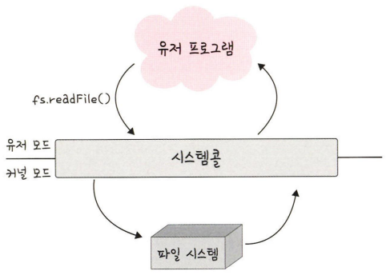

# 3장 운영체제

```markdown
목차
- 3.1 운영체제와 컴퓨터(134)
- 3.2 메모리(142)
- 3.3 프로세스와 스레드(157)
- 3.4 CPU 스케줄링 알고리즘(178)
```

# 3.1 운영체제와 컴퓨터

## 3.1.1 운영체제의 역할과 구조

### 운영체제의 역할

1. **CPU 스케줄링과 프로세스 관리** : CPU 소유권을 어떤 프로세스에 할당할 지, 프로세스의 생성과 삭제, 자원 할당 및 반환 관리
2. **메모리 관리** : 한정된 메모리를 어떤 프로세스에 얼만큼 할당해야 하는지 관리
3. **디스크 파일 관리** : 디스크 파일을 어떠한 방법으로 보관할지 관리
4. **I/O 디바이스 관리** : I/O 디바이스들인 마우스, 키보드와 컴퓨터 간에 데이터를 주고받는 것을 관리

### 운영체제 구조

유저 프로그램이 맨 위에 있고 그 다음으로 GUI, 시스템 콜, 커널, 드라이버가 있으며 가장 밑에 하드웨어가 있는 구조

GUI, 시스템콜, 커널, 드라이버 부분을 묶어 운영체제라고 지칭

[참고] GUI가 없고 CUI만 있는 리눅스 서버도 존재

```markdown
<용어>
- GUI : Graphic User Interface
- CUI : Character User Interface
```

**시스템 콜**

- 운영체제가 커널에 접근하기 위한 인터페이스, 유저 프로그램이 운영체제의 서비스를 받기 위해 커널 함수를 호출할 때 사용
- 유저 프로그램이 I/O 요청으로 트랩(trap)을 발동하면 올바른 I/O 요청인지 확인한 후 유저 모드가 시스템 콜을 통해 커널 모드로 변환되어 실행.
    
    
    
    - 이 때, 유저 모드에서 파일을 읽지 않고 커널 모드로 들어가 파일을 읽고 다시 유저 모드로 돌아가 그 뒤에 있는 유저 프로그램의 로직을 수행
        - 이를 통해 컴퓨터 자원에 대한 직접 접근을 차단할 수 있고 프로그램을 보호할 수 있음
    
    ```markdown
    I/O 요청
    - 입출력 함수, 데이터베이스, 네트워크, 파일 접근 등에 관한 일
    드라이버
    - 하드웨어를 제어하기 위한 소프트웨어
    ```
    

**시스템 콜과 커널, 운영체제**


- 프로세스나 스레드에서 운영체제로 어떠한 요청을 할 때 시스템 콜이라는 인터페이스와 커널을 거쳐 운영체제에 전달
- 이 시스템 콜은 하나의 추상화 계층. 따라서 네트워크 통신이나 데이터베이스와 같은 낮은 단계의 영역 처리에 대한 부분을 많이 신경쓰지 않고 프로그램을 구현할 수 있음

**modebit**

- 시스템콜이 작동될 때 modebit를 참고해서 유저모드와 커널 모드를 구분.
- 1 또는 0의 값을 가지는 플래그 변수
- I/O 디바이스는 운영체제를 통해서만 작동해야 함
    - 유저모드를 기반으로 카메라가 켜진다면 사용자가 의도하지도 않았는데 공격자가 카메라를 갑자기 켜는 등 나쁜짓하기 쉬움
    - 커널 모드를 거쳐 운영체제를 통해 작동한다고 해도 공격을 100% 막을 순 없지만 운영체제를 통해 작동하게 해야 막기가 쉬움 - modebit의 0은 커널모드, 1은 유저모드 라고 설정, 유저 모드일 경우 시스템콜을 못하게 막아서 한정된 일만 가능하게 함
    
    
    
    - 유저 프로그램이 카메라를 이용하려 할 때 시스템콜을 호출하고 modebit를 1에서 0으로 바꾸며 커널 모드로 변경한 후 카메라 자원을 이용한 로직 수행
    - 이후 modebit를 0에서 1로 바꿔 유저모드로 변경 후 로직 수행
    
    ```markdown
    유저 모드 : 유저가 접근할 수 있는 영역을 제한저긍로 두며 컴퓨터 자원에 함부로 침범하지 못하는 모드
    커널 모드 : 모든 컴퓨터 자원에 접근할 수 있는 모드
    커널 : 운영체제의 핵심 부분이자 시스템콜 인터페이스를 제공, 운영체제의 중추적인 역할 수행
    ```
    

## 3.1.2 컴퓨터의 요소


### CPU(Central Processing Unit)

산술 논리 연상 장치, 제어장치, 레지스터로 구성

메모리에 존재하는 명령어를 해석해서 실행하는 일꾼


**제어장치 CU : Control Unit**

- 프로세스 조작을 지시하는 CPU의 부품
- 입출력 장치 간 통신을 제어
- 명령어를 읽고 해석하여 데이터 처리를 위한 순서 결정

**레지스터 Register**

- CPU 안에 있는 매우 빠른 임시 기억 장치
- 개빠름
- CPU는 자체적으로 데이터를 저장할 방법이 없어서 레지스터를 거쳐 데이터를 전달함

**산술 논리 연산장치 ALU : Arithmetric Logic Unit**

- 산술 연산, 논리연산 계산

CPU의 연산 처리


**인터럽트**

- 어떤 신호가 왔을 때 CPU를 잠깐 정지 시키는 것
- 인터럽트 발생 시 인터럽트 핸들러 함수가 모여있는 인터럽트 벡터로 가서 인터럽트 핸들러 함수 실행
    - 인터럽트 간에는 우선순위가 있고 우선순위에 따라 실행
    
    ```markdown
    인터럽트 핸들러 함수
    - 인터럽트가 발생했을 때 이를 핸들링하기 위한 함수.
    - 커널 내부의 IRQ를 통해 호출, request_irq()를 통해 인터럽트 핸들러 함수 등록 가능
    ```
    
- 하드웨어 인터럽트
    - I/O 디바이스에서 발생하는 인터럽트
    - 인터럽트 라인이 설계된 이후 순차적인 인터럽트 실행을 중지하고 운영체제에 시스템콜을 요청해서 원하는 디바이스로 향해 디바이스에 있는 작은 로컬 버퍼에 접근하여 일을 수행
- 소프트웨어 인터럽트
    - 트랩(trap)이라고도 함
    - 프로세스 오류 등으로 프로세스가 시스템 콜을 호출할 때 발동

## DMA 컨트롤러

- I/O 디바이스가 메모리에 직접 접근할 수 있도록 하는 하드웨어 장치
- CPU에만 너무 많은 인터럽트 요청이 들어오기 때문에 CPU 부하를 막아줌 : CPU 보조 일꾼
- 하나의 작업을 CPU와 DMA 컨트롤러가 동시에 하는 것을 방지

### 메모리

- 전자회로에서 데이터나 상태, 명령어 등을 기록하는 장치
- 보통 RAM(Random Access Memory)을 말함
- CPU는 계산담당, 메모리는 기억 담당

### 타이머

- 몇초 안에는 작업이 끝나야 한다는 것을 정하고 특정 프로그램에 시간 제한을 다는 역할
- 시간이 많이 걸리는 프로그램이 작동할 때 제한을 걸기위해 존재

### 디바이스 컨트롤러

- 컴퓨터와 연결되어있는 IO 디바이스들의 작은 CPU를 의미

# 3.2 메모리

메모리 계층과 메모리 관리

## 3.2.1 메모리 계층

레지스터, 캐시, 메모리, 저장 장치로 구성


1. 레지스터(register): CPU 안에 있는 작은 메모리. 휘발성, 속도 가장 빠름, 기억 용량이 가장 적음
2. 캐시(cache): L1, L2 캐시를 지칭. 휘발성, 속도 빠름, 기억 용량 적음. L3 캐시도 있음
3. 주기억장치(RAM): 휘발성, 속도 보통, 기억 용량 보통
4. 보조기억장치(HDD, SDD): 휘발성, 속도 낮음, 기억 용량 많음

램(RAM)

- 하드디스크로부터 일정량의 데이터를 복사해서 임시저장하고 이를 필요 시마다 CPU에 빠르게 전달
- 계층 위로 올라갈 수록 가격은 비싸짐, 속도는 빨라짐, 용량은 작아짐 → 경제성과 캐시 때문

### 캐시

- 데이터를 미리 복사해 놓은 임시 저장소
- 병목현상을 줄이기 위한 메모리
    
    캐싱 계층
    
    - 계층과 계층사이에 있는 계층의 속도 차이를 해결하는 역할

**지역성의 원리**

- 캐시 계층을 두는 것 말고 캐시를 직접 설정 시 → 자주 사용하는 데이터를 기반으로 설정
- 자주 사용? → 지역성 : 시간 지역성(temporal locality), 공간 지역성(spatial locality)

시간 지역성

- 최근 사용한 데이터에 다시 접근하려는 특성

공간 지역성

- 최근 접근한 데이터를 이루고 있는 공간이나 그 가까운 공간에 접근하는 특성

### 캐시히트와 캐시미스

캐시에서 원하는 데이터를 찾으면 캐시히트

해당 데이터가 캐시에 없다면 주 메모리로 가서 데이터를 찾아 오는 것을 캐시미스


**캐시 매핑**

- 캐시가 히트되기 위해 매핑하는 방법
- CPU의 레지스터와 RAM간에 데이터를 주고 받을 때를 기반으로 설명
- 작은 레지스터가 캐시 계층으로써 역할을 잘 해주려면 이 매핑을 어떻게 하느냐갸 매우 중요
- 종류
    - 직접매핑(directed mapping)
    - 연관매핑(associative mapping)
    - 집합연관매핑(set associative mapping)

**웹 브라우저의 캐시**

소프트웨어적인 대표적인 캐시 : 웹 브라우저의 작은 저장소 쿠키, 로컬 스토리지, 세션 스토리지

- 사용자의 커스텀 정보, 인증 모듈 관련 사항을 웹 브라우저에서 저장해서 추후 서버에 요청 시 자신을 나타내는 아이덴티티나 중복 요청 방지를 위해 사용됨
- 쿠키
    - 만료 기한이 있는 키 - 값 저장소
    - 클라이언트 또는 서버에서 만료 기한 등을 정할 수 있는데, 보통 서버에서 만료 기한을 정함
- 로컬 스토리지
    - 만료 기한이 없는 키 - 값 저장소
    - 10MB까지 저장
    - 웹 브라우저를 닫아도 유지되고 도메인 단위로 저장, 생성됨
    - 클라이언트에서만 수정 가능
- 세션 스토리지
    - 만료기한이 없는 키 - 값 저장소
    - 탭 단위로 세션 스토리지를 생성, 탭을 닫을 때 해당 데이터도 삭제
    - 5MB까지 저장
    - 클라이언트에서만 수정 가능

데이터베이스의 캐싱 계층


데이터베이스 시스템을 구축할 때도 메인 데이터베이스 위에 레디스(redis) 데이터베이스 계층을 ‘캐싱 계층’으로 둬서 형능을 향상시키기도 함

## 3.2.2 메모리 관리

### 가상 메모리(virtual memory)

- 메모리 관리 기법의 하나
- 실제로 이용 가능한 메모리 자원을 추상화하여 이를 사용하는 사용자들에게 매우 큰 메모리로 보이게 만드는 것
    
    
    
    - 가상적으로 주어진 주소를 가상 주소(logical address)
    - 실제 메모리상에 있는 주소를 실제 주소(physical address)
    - 가상 주소는 메모리 관리 장치(MMU)에 의해 실제 주소로 변환 됨
    - 이 덕분에 사용자는 실제 주소를 의식할 필요 없이 프로그램을 구축할 수 있음
- 가상 메모리는 가상 주소와 실제 주소가 매핑되어 있고 프로세스의 주소 정보가 들어 있는 페이지 테이블로 관리
    - 이때 속도 향상을 위해 TLB를 사용
        - TLB - 메모리와 CPU 사이에 있는 주소 변환을 위한 캐시
        - 페이지 테이블에 있는 리스트를 보관, CPU가 페이지 테이블까지 가지 않도록 해 속도를 향상 시킬 수 있는 캐시 계층

스와핑(swapping)

- 가상 메모리에는 존재하지만 실제 메모리인 RAM에는 현재 없는 데이터나 코드에 접근 시 페이지 폴드 발생
- 이를 방지하기 위해 당장 사용하지 않는 영역을 하드디스크로 옮겨 필요 시 다시 RAM으로 불러와 올리고, 사용하지 않으면 다시 하드디스크로 내름을 반복하여 RAM을 효과적으로 관리하는 것을 스와핑

페이지 폴트(page fault)

- 프로세스의 주소 공간에는 존재하지만 지금 이 컴퓨터의 RAM에는 없는 데이터에 접근 했을 경우 발생
- 운영체제는 다음 과정으로 데이터를 메모리로 가져와서 마치 페이지 폴트가 전혀 발생하지 않은 것처럼 프로그램이 작동하게 해줌
    1. CPU는 물리 메모리를 확인하여 해당 페이지가 없으면 트랩을 발생해서 운영체제에 알림
    2. 운영체제는 CPU의 동작을 잠시 멈춤
    3. 운영체제는 페이지 테이블을 확인하여 가상 메모리에 페이지가 존재하는지 확인하고, 없으면 프로세스를 중단하고 현재 물리 메모리에 비어있는 프레임이 있는지 찾고, 물리 메모리에도 없다면 스와핑이 발동
    4. 비어 있는 프레임에 해당 페이지를 로드하고, 페이지 테이블을 최신화 함
    5. 중단되었던 CPU를 다시 시작
    
    ```markdown
    페이지(page) - 가상 메모리를 사용하는 최소 크기 단위
    프레임(frame) - 실제 메모리를 사용하는 최소 크기 단위
    ```
    

### 스레싱(thrashing)

- 메모리의 페이지 폴트율이 높은 것을 의미하며, 이는 컴퓨터의 심각한 성능 저하 초래
    
    
    
- 스레싱은 메모리에 너무 많은 프로세스가 동시에 올라가게 되면 스와핑이 많이 일어나서 발생
- 페이지 폴트 발생 시 CPU 이용률 저하 → CPU 이용률 저하 시 운영체제는 “CPU가 한가한가?”라고 생각하여 가용성을 더 높이기 위해 많은 프로세스를 메모리에 올림 → 스레싱 발생
- 메모리를 늘리거나 HDD를 사용하면 SSD로 변경하여 해결 가능

**작업 세트(working set)**

- 프로세스의 과거 사용 이력인 지역성(locality)을 통해 결정된 페이지 집합을 만들어서 미리 메모리에 로드하는 것
- 미리 메모리에 로드하면 탐색에 드는 비용을 줄일 수 있고 스와핑 또한 줄일 수 있음

**PFF(Page Fault Frequency)**

- 페이지 폴트 빈도를 조절하는 방법, 상한선과 하한선을 만드는 방법
- 상한선 도달 시 페이지를 늘리고 하한선 도달 시 페이지 줄임

### 메모리 할당

시작 메모리 위치, 메모리의 할당 크기를 기반으로 할당, 연속 할당과 불연속 할당으로 나뉨

**연속 할당**

- 연속적으로 공간을 할당 하는 것
    
    
    
    메모리를 미리 나누어 관리하는 고정 분할 방식과 매 시점 프로그램의 크기에 맞게 메모리를 분할하여 사용하는 가변 분할 방식이 있음
    
    - 고정 분할 방식(fixed partition allocation)
        - 메모리를 미리 나누어 관리하는 방식
        - 메모리가 미리 나뉘어 있기 때문에 융통성이 없음
        - 내부 단편화 발생
    - 가변 분할 방식(variable partition allocation)
        - 매 시점 프로그램의 크기에 맞게 동적으로 메모리를 나눠 사용
        - 내부 단편화는 발생하지 않고 외부 단편화는 발생할 수 있음
        - 최초적합, 최적적합, 최악적합이 있음
            - 최초 적합(first fit)
                - 위 쪽이나 아래쪽으로 시작해서 홀을 찾으면 바로 할당
            - 최적 적합(best fit)
                - 프로세스의 크기 이상인 공간 중 가장 작은 홀부터 할당
            - 최악 적합(worst fit)
                - 프로세스의 크기와 가장 많이 차이 나는 홀에 할당
        
        ```markdown
        내부 단편화(internal fragmentation)
        - 메모리를 나눈 크기보다 프로그램이 작아서 들어가지 못하는 공간이 많이 발생하는 현상
        
        외부 단편화(external fragmentation)
        - 메모리를 나눈 크기보다 프로그램이 커서 들어가지 못하는 공간이 많이 발생하는 현상,
          예를 들어 100MB를 55MB, 45MB로 나눴지만 프로그램의 크기는 70MB일 때 들어가지 못하는 것
        
        홀(hole)
        - 할당할 수 있는 비어 있는 메모리 공간
        ```
        

**불연속 할당**

메모리를 연속적으로 할당하지 않는 불연속 할당은 페이징 기법이 존재

- 메모리를 동일한 페이지로 나누고 프로그램마다 페이지 테이블을 두어 이를 통해 메모리에 프로그램을 할당
- 추가로 세그멘테이션, 페이지드 세그멘테이션 존재

페이징(paging)

- 동일한 크기의 페이지 단위로 나누어 메모리의 서로 다른 위치에 프로세스를  할당
- 홀의 크기가 균일하지 않은 문제가 없어지지만 주소 변환이 복잡해짐

세그멘테이션(segmentation)

- 페이지 단위가 아닌 의미 단위인 세그먼트(segment)로 나누는 방식
- 프로세스는 코드, 데이터, 스택, 힙 등으로 이뤄지는데, 코드와 데이터 등 이를 기반으로 나눌 수도 있으며 함수 단위로 나눌 수도 있음
- 공유와 보안 측면에서 좋으며 홀 크기가 균일하지 않은 문제 발생

페이지드 세그멘테이션(paged segmentation)

- 공유나 보안을 의미 단위의 세그먼트로 나누고, 물리적 메모리 페이지는 나누는 것

### 페이지 교체 알고리즘

메모리는 한정되어 있기 때문에 스와핑이 많이 일어남. 스와핑은 많이 일어나지 않도록 설계되어야하며 이는 페이지 교체 알고리즘을 기반으로 스와핑이 발생

**오프라인 알고리즘(offline algorithm)**

- 먼 미래에 참조되는 페이지와 현재 할당하는 페이지를 바꾸는 알고리즘이며, 가장 좋은 방법

즉, 사용할 수 없는 알고리즘이지만 다른 알고리즘과의 성능 비교에 대한 기준을 제공

**FIFO**

- 가장 먼저 온 페이지를 교체 영역에 가장 먼저 놓는 방법

**LRU(Least Recentle Used)**

- 참조가 가장 오래된 페이지를 바꿈
- ‘오래된’ 것을 파악하기 위해 각 페이지마다 계수기, 스택을 두어야 하는 문제 존재
    
    
    
    - 5번째에 5번 페이지가 들어왔을 때 가장 오래된 1번 페이지와 스왑
- LRU 구현을 프로그래밍으로 구현 시 보통 두 개의 자료 구조로 구현
    - 해시 테이블
        - 이중 연결 리스트에서 빠르게 찾을 수 있도록 사용
    - 이중 연결 리스트
        - 한정된 메모리를 나타냄

**NUR(Not Used Recently)**


- clock 알고리즘이라 하며 0과 1을 가진 비트를 둠
- 1은 최근에 참조되었고 0은 참조되지 않음을 의미
- 시계방향으로 돌면서 0을 찾고 0을 찾은 순간 해당 프로세스를 교체하고, 해당 부분을 1로 바꾸는 알고리즘

**LFU(Least Frequently Used)**

- 가장 참조 횟수가 적은 페이지를 교체 = 많이 사용되지 않은 것을 교체

# 3.3 프로세스와 스레드

프로세스

- 컴퓨터에서 실행되고 있는 프로그램
- CPU 스케줄링의 대상이 되는 작업(task)라는 용어와 거의 같은 의미
    
    
    
    - 프로그램이 메모리에 올라가면 프로세스가 되는 인스턴스화가 발생, 이후 운영체제의 CPU 스케줄러에 따라 CPU가 프로세스를 실행

## 3.3.1 프로세스와 컴파일 과정

프로세스

- 프로그램으로부터 인스턴스화 된 것

프로그램

- 컴파일러가 컴파일 과정을 거쳐 컴퓨터가 이해할 수 있는 기계어로 번역되어 실행될 수 있는 파일이 되는 것
    - 컴파일 과정(C base)
        
        
        

### 전처리

- 소스코드의 주석 제거, 헤더파일을 병합하여 매크로를 치환

### 컴파일러

- 오류 처리, 코드 최적화 작업, 어셈블리어로 변환

### 어셈블러

- 어셈블리어는 목적 코드(object code)로 변환
    - 이 때, 확장자는 운영체제마다 다른데 리눅스에서는 .o
        - .c라는 파일을 만들고 컴파일을 진행하면 .o라는 파일이 생성되는 것
        
        
        

### 링커

- 프로그램 내에 있는 라이브러리 함수 또는 다른 파일들과 목적 코드를 결합하여 실행파일 생성.
- 실행파일의 확장자는 .exe 또는 .out이라는 확장자를 가짐

**정적 라이브러리와 동적 라이브러리**

- 정적 라이브러리
    - 프로그램 빌드 시 라이브러리가 제공하는 모든 코드를 실행 파일에 넣는 방식, 시스템 환경 등 외부 의존도가 낮고 코드 중복 등 메모리 효율성이 떨어짐
- 동적 라이브러리
    - 프로그램 실행 시 필요할 때만 DLL이라는 함수 정보를 통해 참조하는 방식, 메모리 효율성에서의 장점과 외부 의존도가 높아진다는 단점

## 3.3.2 프로세스의 상태


### 생성 상태(create)

- 프로세스가 생성된 상태를 의미, fork() 또는 exec() 함수를 통해 생성. 이 때 PCB 할당

**fork()**

- 부모 프로세스의 주소공간을 그대로 복사하여, 새로운 자식 프로세스를 생성하는 함수
- 주소공간만 복사. 부모 프로세스의 비동기 작업 등을 상속하지는 않음

**exec()**

- 새롭게 프로세스를 생성하는 함수

### 대기 상태(ready)

- 메모리 공간이 충분하면 메모리를 할당받고 아니면 아닌 상태로 대기
- CPU 스케줄러로부터 CPU 소유권이 넘어오기를 기다리는 상태

### 대기 중단 상태(ready suspended)

- 메모리 부족으로 일시 중단된 상태

### 실행 상태(running)

- CPU 소유권과 메모리를 할당받고 인스트럭션을 수행중인 상태 의미
- 이를 CPU burst가 일어났다고도 표현

### 중단 상태(blocked)

- 어떤 이벤트가 발생한 이후 기다리며 프로세스가 차단된 상태
- I/O 디바이스에 의한 인터럽트로 이런 현상이 자주 발생

### 일시 중단 상태(blocked suspended)

- 대기 중단과 유사
- 중단된 상태에서 프로세스가 실행되려고 했지만 메모리 부족으로 일시 중단된 상태

### 종료 상태(terminated)

- 메모리와 CPU 소유권을 모두 놓고 가는 상태
- 자연스럽게 종료되는 것도 있지만 부모 프로세스가 자식 프로세스를 강제시키는 비자발적 종료(abort)로 종료되는 것도 있음
- 자식 프로세스에 할당된 자원의 한계치를 넘어서거나 부모 프로세스가 종료되거나 사용자가 process kill 등 여러 명령어로 프로세스를 종료할 때 발생

## 3.3.3 프로세스의 메모리 구조


- 위에서부터 스택, 힙, 데이터 영역, 코드 영역으로 분리
    - 스택은 위에서부터 할당
    - 힙은 아래 주소부터 할당

### 스택(stack)

- 지역변수, 매개변수, 함수 저장
- 컴파일 시에 크기가 결정
- 동적인 특징
- 함수가 함수를 재귀적으로 호출하면서 동적으로 크기가 늘어날 수 있는데, 이 때 힙과 스택의 메모리 영역이 겹치면 안되기 때문에 스택 사이의 공간을 비워놓음

### 힙(heap)

- 동적 할당 때 사용됨
- 런타입 시 크기 결정
- 벡터같은 동적 배열은 힙에 동적 할당됨

### 데이터 영역(BSS segment, Data segment)

- 전역 변수, 정적 변수 할당
- 프로그램이 종료되면 사라지는 변수가 들어있는 영역
- BSS 영역과 Data 영역으로 나뉨
    - BSS 영역
        - 초기화 되지 않은 변수가 0으로 초기화되어 저장
    - Data 영역
        - 0이 아닌 다른 값으로 할당된 변수들이 저장

### 코드 영역(code Segment)

- 프로그램에 내장되어 있는 소스코드가 들어가는 영역

## 3.3.4 PCB(Process Control Block)

- 운영체제에서 프로세스에 대한 메타데이터를 저장한 ‘데이터’
- 프로세스 제어 블록이라고도 함
- 프로세스가 생성되면 운영체제는 해당 PCB를 생성
- 프로그램이 실행되면 프로세스가 생성, 프로세스 주소 값들에 스택, 힙 등 구조를 기반으로 메모리 할당. 이 프로세스의 메타 데이터들이 PCB에 저장되어 관리됨. 프로세스의 중요한 정보를 포함하고 있기 때문에 일반 사용자가 접근하지 못하도록 커널 스택의 가장 앞부분에서 관리됨

```html
메타 데이터
- 데이터에 관한 구조화된 데이터이자 데이터를 설명하는 작은 데이터,
	대량의 정보 가운데에서 찾고 있는 정보를 효율적으로 찾아내서 이용하기 위해
	일정한 규칙에 따라 콘텐츠에 대해 부여되는 데이터
```

### PCB 구조

- 프로세스 스케줄링 상태
    - ‘준비’, ‘일시중단’ 등 프로세스가 CPU에 대한 소유권을 얻은 이후의 상태
- 프로세스 ID
    - 프로세스 ID, 해당 프로세스의 자식 프로세스 ID
- 프로세스 권한
    - 컴퓨터 자원 또는 I/O 디바이스에 대한 권한 정보
- 프로그램 카운터
    - 프로세스에서 실행해야 할 다음 명령어의 주소에 대한 포인터
- CPU 레지스터
    - 프로세스를 실행하기 위해 저장해야 할 레지스터에 대한 정보
- CPU 스케줄링 정보
    - CPU 스케줄러에 의해 중단된 시간 등에 대한 정보
- 계정 정보
    - 프로세스 실행에 사용된 CPU 사용량, 실행한 유저의 정보
- I/O 상태 정보
    - 프로세스에 할당된 I/O 디바이스 목록

### 컨텍스트 스위칭(context switching)

- PCB를 교환하는 과정
- 한 프로세스에 할당된 시간이 끝나거나 인터럽트에 의해 발생
- 실제로 어떠한 시점에서 실행되고 있는 프로세스는 단 한 개


- 한 개의 프로세스 A가 실행하다 멈추고, 프로세스 A의 PCB를 저장하고 다시 프로세스 B를 로드하여 실행.
- 그리고 다시 프로세스 B의 PCB를 저장하고 프로세스 A의 PCB를 로드.
- 컨텍스트 스위칭이 일어날 때 앞의 그림처럼 유휴 시간(die time)이 발생, 캐시미스라는 컨텍스트 스위칭에 드는 비용 존재

**비용 : 캐시미스**

- 컨텍스트 스위칭이 일어날 때 프로세스가 가지고 있는 메모리 주소가 그대로 있으면 잘못된 주소 변환이 생기브로 캐시 클리어 과정을 거치고, 이 때문에 캐시미스 발생

**스레드에서의 컨텍스트 스위칭**

- 컨텍스트 스위칭은 스레드에서도 발생
- 스레드는 스택 영역을 제외한 모든 메모리를 공유하기 때문에 스레드 컨텍스트 스위칭의 경우 비용이 더 적고 시간도 더 적게 걸림

## 3.3.5 멀티 프로세싱

- 여러 개의 프로세스, 즉 멀티 프로세스를 통해 동시에 두 가지 이상의 일을 수행하는 것
- 하나 이상의 일을 병렬로 처리할 수 있으며, 특정 프로세스의 메모리, 프로세스 중 일부에 문제가 발생하더라도 다른 프로세스를 이용해서 처리할 수 있으므로 신뢰성이 높은 강점이 있음

### 웹 브라우저


- 브라우저 프로세스
    - 주소 표시줄, 북마크 막대, 뒤로 가기 버튼, 앞으로가기 버튼 등을 담당, 네트워크 요청이나 파일 접근같은 권한을 담당
- 렌더러 프로세스
    - 웹사이트가 ‘보이는’ 모든 부분 제어
- 플러그인 프로세스
    - 웹 사이트에서 사용하는 플러그인을 제어
- GPU 프로세스
    - GPU를 이용해서 화면을 그리는 부분 제어

### IPC(Inter Process Communication)

- 멀티 프로세스는 IPC가 가능
- IPC는 프로세스끼리 데이터를 주고받는 공유 데이터를 관리하는 메커니즘을 의미
- 클라이언트와 서버
    - 클라이언트는 데이터를 요청, 서버는 클라이언트의 요청에 응답하는 것
- IPC의 종류
    - 공유 메모리, 파일, 소켓, 익명 파이프, 명명 파이프, 메시지 큐
    - 메모리가 완전히 공유되는 스레드보다는 속도가 떨어짐

**공유 메모리(shared memory)**

- 여러 프로세스에 동일한 메모리 블록에 대한 접근권한이 부여되어 프로세스가 서로 통신할 수 있도록 공유 버퍼를 생성하는 것
    
    
    
- 기본적으로 각 프로세스의 메모리를 다른 프로세스가 접근할 수 없지만 공유 메모리를 통해 여러 프로세스가 하나의 메모리를 공유할 수 있음
- IPC 방식 중 어떠한 매개체를 통해 데이터를 주고받는 것이 아닌 메모리 자체를 공유하기 때문에 불필요한 데이터 복사의 오버헤드가 발생하지 않아 가장 빠르며 같은 메모리 영역을 여러 프로세스가 공유하기 때문에 동기화 필요
- 하드웨어 관점에서 공유 메모리는 CPU가 접근할 수 있는 큰 랜덤 접근 메모리인 RAM을 가리키기도 함

**파일**

- 디스크에 저장된 데이터 또는 파일 서버에서 제공한 데이터
    - 이를 기반으로 프로세스 간 통신 진행

**소켓**

- 동일한 컴퓨터의 다른 프로세스나 네트워크의 다른 컴퓨터로 네트워크 인터페이스를 통해 전송하는 데이터를 의미
- TCP, UDP 존재

**익명 파이프(unamed pipe)**

- 프로세스 간에 FIFO 방식으로 읽히는 임시 공간인 파이프를 기반으로 데이터를 주고 받으며, 단방향 방식의 읽기 전용, 쓰기 전용 파이프를 만들어서 작동하는 방식 의미
    
    
    
    - 부모, 자식 프로세스 간에만 사용 가능, 다른 네트워크 상에서는 사용 불가능
- **명명된 파이프(named pipe)**
    - 파이프 서버와 하나 이상의 파이프 클라이언트 간의 통신을 위한 명명된 단방향 또는 이중 파이프를 의미
    - 클라이언트 / 서버 통신을 위한 별도 파이프를 제공, 여러 파이프를 동시에 사용할 수 있음
    - 컴퓨터의 프로세스 끼리 또는 다른 네트워크 상의 컴퓨터와도 통신 가능
    
    
    
    - 서버용 파이프와 클라이언트용 파이프로 구분해서 작동, 하나의 인스턴스를 열거나 여러 개의 인스턴스를 기반으로 통신

**메시지 큐(queue)**

- 데이터 구조 형태로 관리하는 것
- 커널의 전역변수 형태 등 커널에서 전역적으로 관리되며 다른 IPC 방식에 비해 사용법이 매우 직관적, 간단함
- 다른 코드의 수정 없이 단지 몇 줄의 코드를 추가시켜 간단하게 메시지 큐에 접근 가능
    
    
    
- 공유 메모리를 통해 IPC를 구현할 때 쓰기 및 읽기 빈도가 높으면 동기화 때문에 기능을 구현하는 것이 매우 복잡해지는데, 이 때 대안으로 메시지 큐를 사용하기도 함

## 3.3.6 스레드와 멀티 스레딩

### 스레드

스레드는 프로세스의 실행 가능한 가장 작은 단위. 프로세스는 여러 스레드를 가질 수 있음


코드, 데이터, 스택, 힙을 각각 생성하는 프로세스와 달리 스레드는 코드, 데이터, 힙은 스레드끼리 서로 공유, 그 외 영역은 각각 생성

### 멀티 스레딩

- 프로세스 내 작업을 여러 개의 스레드, 멀티 스레드로 처리하는 기법
- 스레드끼리 서로 자원을 공유하기 때문에 효율성이 높음
- 예) 웹 요청을 처리할 때 새 프로세스를 생성하는 대신 스레드를 사용하는 웹 서버의 경우 훨씬 적은 리소스를 소비, 한 스레드가 중단(blocked)되어도 다른 스레드는 실행(running) 상태이기 때문에 중단되지 않은 빠른 처리 가능 → 동시성에도 큰 장점
- 한 스레드에 문제가 생기면 다른 스레드에도 영향을 끼쳐 스레드로 이뤄진 프로세스의 경우 영향을 줄 수 있음
    
    ```html
    동시성
    - 서로 독립적인 작업들을 작은 단위로 나누고 동시에 실행되는 것처럼 보여주는 것
    ```
    
- ex) 웹 브라우저의 렌더러 프로세스
    
    
    

## 3.3.7 공유 자원과 임계 영억

### 공유 자원(shared resource)

- 시스템 안에서 각 프로세스, 스레드가 함께 접근할 수 있는 모니터, 프린터, 메모리, 파일, 데이터 등의 자원이나 변수
- 두 개 이상의 프로세스가 동시에 읽거나 쓰는 상황을 경쟁상태(race condition)
    - 동시에 접근을 시도할 때 접근의 타이밍이나 순서 등이 결괏값에 영향을 줄 수 있는 상태
- ex) 종선 코인 100개
    
    
    
    - 프로세스 A와 프로세스 B가 동시에 접근하여 타이밍이 꼬여 정상 결괏값은 300인데 200 출력

### 임계 영역(critical section)

- 공유 자원에 접근할 때 순서 등의 이유로 결과가 달라지는 영역을 임계영역이라 함
- 임계 영역을 해결하기 위한 방법은 크게 뮤텍스, 세마포어, 모니터 세 가지, 이 방법 모두 상호 배제, 한정 대기, 융통성이란 조건을 만족
    
    ```html
    상호 배제
    - 한 프로세스가 임계 영역에 들어갔을 때 다른 프로세스는 들어갈 수 없다
    한정 대기
    - 특정 프로세스가 영원히 임계 영역에 들어가지 못하면 안된다
    융통성
    - 한 프로세스가 다른 프로세스의 일을 방해해선 안된다
    ```
    
    - 잠금(lock)이라는 메커니즘을 토대로 함
    - 예) 임계 구역을 화장실이라 가정하면 화장실에 A라는 사람이 들어간 다음 문을 잠금. 그리고 다음사람이 이를 기다리다가 A가 나오면 화장실을 쓸 수 있음

**뮤텍스(mutex)**

- 공유 자원을 사용하기 전에 설정하고 사용한 후에 해제하는 잠금
- 잠금이 설정되면 다른 스레드는 잠긴 코드 영역에 접근 불가능
- 뮤텍스는 하나의 상태(잠금 또는 잠금 해제)만 가짐
    
    
    

**세마포어(semaphore)**

- 일반화된 뮤텍스
- 간단한 정수 값과 두 가지 함수 wait(또는 P 함수) 및 signal(또는 V 함수)로 공유 자원에 대한 접근 처리
- wait()
    - 자신의 차례가 올 때까지 기다리는 함수
- signal()
    - 다음 프로세스로 순서를 넘겨주는 함수
    
    
    
- 프로세스가 공유 자원에 접근하면 세마포어에서 wait() 작업을 수행하고 프로세스가 공유 자원을 해제하면 세마포어에서 signal() 작업 수행
- 세마포어에는 조건 변수가 없고 프로세스가 세마포어 값을 수정할 때 다른 프로세스는 동시에 세마포어 값을 정할 수 없음
- **바이너리 세마포어**
    - 0과 1의 두 가지 값만 가질 수 있는 세마포어
    - 구현의 유사성으로 인해 뮤텍스는 바이너리 세마포어라고 할 수 있음
    - 하지만 엄밀히 말하면 뮤텍스는 리소스에 대한 접근을 동기화하는데 사용되는 잠금 메커니즘, 세마포어는 신호를 기반으로 상호 배제가 일어나는 신호 매커니즘
    - ex) 휴대폰으로 노래 듣다가 전화오면 노래가 중지되고 통화 처리작업에 관한 인터페이스가 등장하는 것
- **카운팅 세마포어**
    - 여러 개의 값을 가질 수 있는 세마포어, 여러 자원에 대한 접근을 제어하는 데 사용

**모니터**

- 둘 이상의 스레드나 프로세스가 공유 자원에 안전하게 접근할 수 있도록 공유 자원을 숨기고 해당 접근에 대해 인터페이스만 제공
    
    
    
    - 모니터는 모니터 큐를 통해 공유 자원에 대한 작업들을 순차적으로 처리
    - 모니터는 세마포어보다 구현이 쉽고, 모니터에서 상호 배제는 자동, 세마포어에서는 상호배제를 명시적으로 구현해야 함

## 3.3.8 교착 상태(deadlock)

- 두 개 이상의 프로세스들이 서로가 가진 자원을 기다리며 중단된 상태
    
    
    

### 교착상태의 원인

- 상호 배제
    - 한 프로세스가 자원을 독점하고 있으며 다른 프로세스들은 접근이 불가능
- 점유 대기
    - 특정 프로세스가 점유한 자원을 다른 프로세스가 요청하는 상태
- 비선점
    - 다른 프로세스의 자원을 강제적으로 가져올 수 없음
- 환형 대기
    - 프로세스 A는 프로세스 B의 자원을 요구하고, 프로세스 B는 프로세스 A의 자원을 요구하는 등 서로가 서로의 자원을 요구하는 상황

### 교착상태 해결방법

1. 자원을 할당할 때 애초에 조건이 성립되지 않도록 설계
2. 교착 상태 가능성이 없을 때만 자원 할당되며, 프로세스당 요청할 자원들의 최대치를 통해 자원 할당 가능 여부를 파악하는 ‘은행원 알고리즘’ 적용
    
    ```html
    은행원 알고리즘
    - 총 자원의 양과 현재 할당한 자원의 양을 기준으로 안정 또는 불안정 상태로 나누고
    	안정 상태로 가도록 자원을 할당하는 알고리즘
    ```
    
3. 교착상태가 발생하면 사이클이 있는지 찾아보고 이에 관련된 프로세스를 한 개씩 지움
4. 교착 상태는 매우 드물게 일어나기 때문에 이를 처리하는 비용이 더 커서 교착상태가 발생하면 사용자가 작업을 종료함.
    - ex) 프로세스를 실행시키다 ‘응답없음’이라고 뜸

# 3.4 CPU 스케줄링 알고리즘

CPU 스케줄러는 CPU 스케줄링 알고리즘에 따라 프로세스에서 해야 하는 일을 스레드 단위로 CPU에 할당


프로그램이 실행될 때는 CPU 스케줄링 알고리즘이 어떤 프로그램에 CPU 소유권을 줄 것인지를 결정함. 이 알고리즘은 CPU 이용률은 높게, 주어진 시간에 많은 일을 하게, 준비 큐(ready queue)에 있는 프로세스는 적게, 응답 시간은 짧게 설정하는 것을 목표로 함

## 3.4.1 비선점형 방식(non-preemtive)

프로세스가 스스로 CPU 소유권을 포기하는 방식, 강제로 프로세스를 중지하지 않음. 따라서 컨텍스트 스위칭으로 인한 부하가 적음

### FCFS(First Come, First Served)

- 가장 먼저 들어온 것을 가장 먼저 처리하는 알고리즘
- 길게 수행되는 프로세스 때문에 ‘준비 큐에서 오래 기다리는 현상(convoy effect)’ 발생하는 단점

### SJF(Shortest Job First)

- 실행시간이 가장 짧은 프로세스를 가장 먼저 실행하는 알고리즘
- 긴 시간을 가진 프로세스가 실행되지 않는 현상(starvation) 발생, 평균 대기 시간이 가장 짧음.
- 하지만 실제로는 실행 시간을 알 수 없기 때문에 과거의 실행했던 시간을 토대로 추측해서 사용

### 우선순위

- 기존 SJF 스케줄링의 경우 긴 시간을 가진 프로세스가 실행되지 않는 현상 존재
- 이는 오래된 작업일 수록 우선순위를 높이는 방법(aging)을 통해 단점을 보완한 알고리즘

## 3.4.2 선점형 방식(preemptive)

- 현대 운영체제가 쓰는 방식으로 지금 사용하고 있는 프로세스를 알고리즘에 의해 중단시켜 버리고 강제로 다른 프로세스에 CPU 소유권을 할당하는 방식

### 라운드 로빈(Round Robin)

- 현대 컴퓨터가 쓰는 스케줄링인 우선순위 스케줄링(priority scheduling)의 일종으로 각 프로세스는 동일한 할당 시간을 주고 그 안에 끝나지 않으면 다시 준비 큐(ready queue)의 뒤로가는 알고리즘
- 일반적으로 전체 작업 시간은 길어지지만 평균 응답 시간은 짧아진다는 특징
- 로드 밸런서에서 트래픽 분산 알고리즘으로도 쓰임

### SRF

- SJF는 중간에 실행 시간이 더 짧은 작업이 들어와도 기존 짧은 작업을 모두 수행하고 그 다음 짧은 작업을 이어 나가는데, SRF는 중간에 더 짧은 작업이 들어오면 수행하던 프로세스를 중지하고 해당 프로세스를 수행하는 알고리즘

### 다단계 큐

- 우선순위에 따른 준비 큐를 여러 개 사용하고, 큐마다 라운드 로빈이나 FCFS 등 다른 스케줄링 알고리즘을 적용한 것
- 큐 간의 프로세스 이동이 안되므로 스케줄링 부담이 적지만 유연성이 떨어지는 특징
    
    