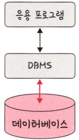
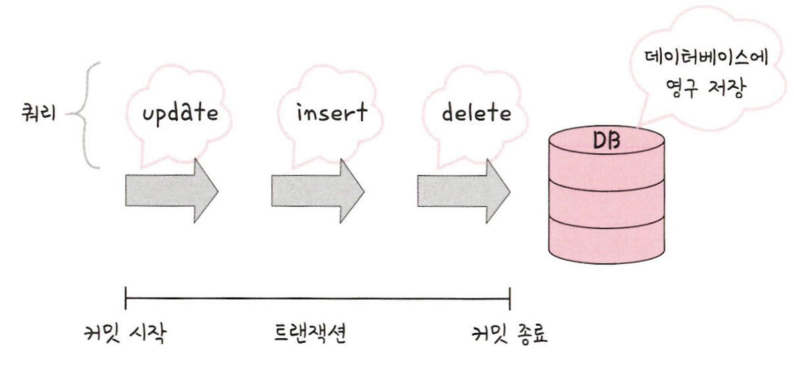
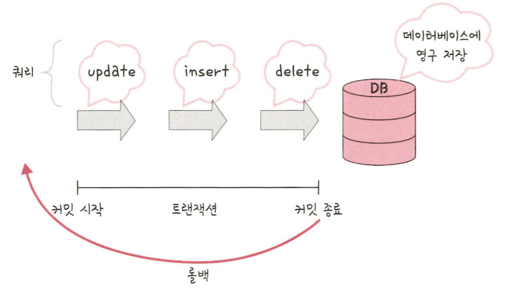
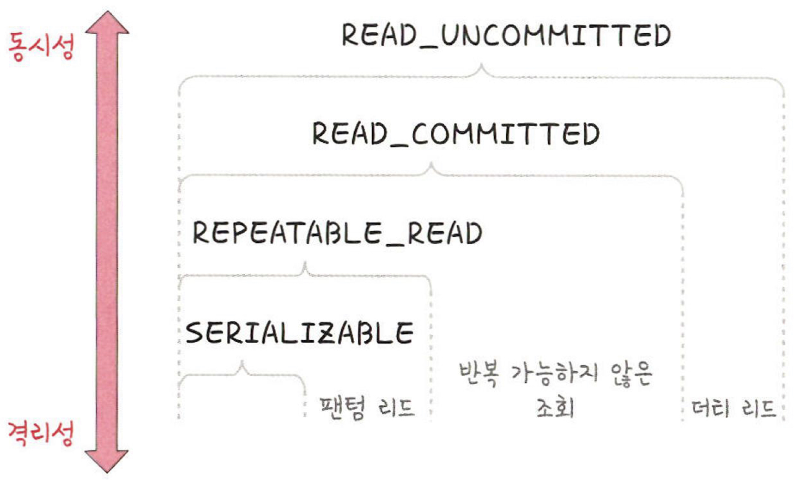
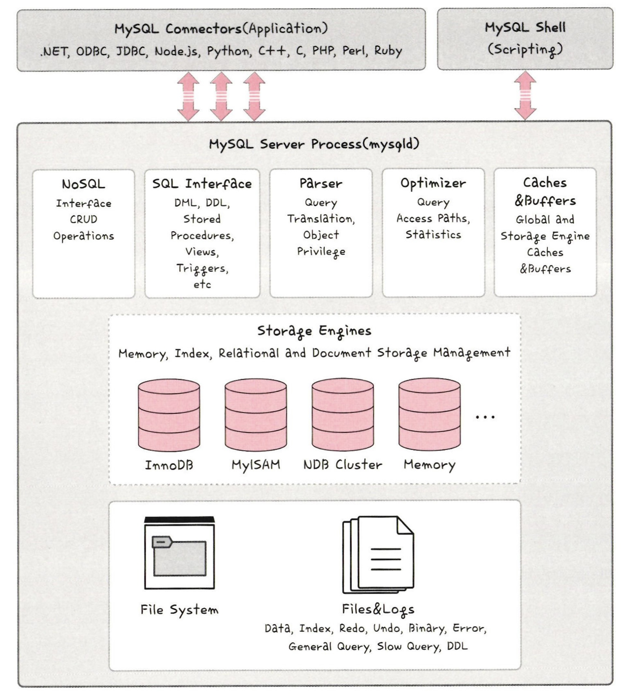
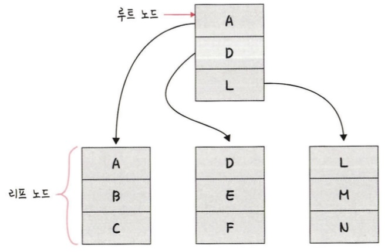
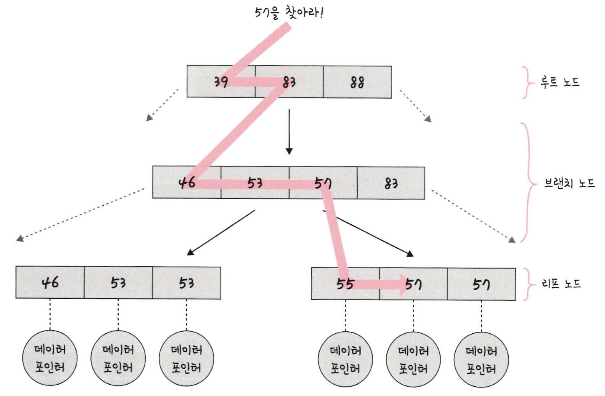
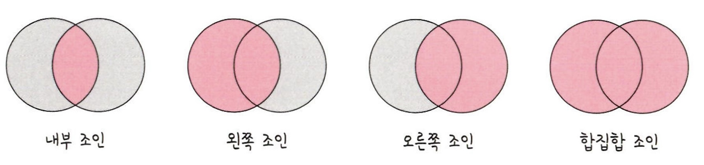
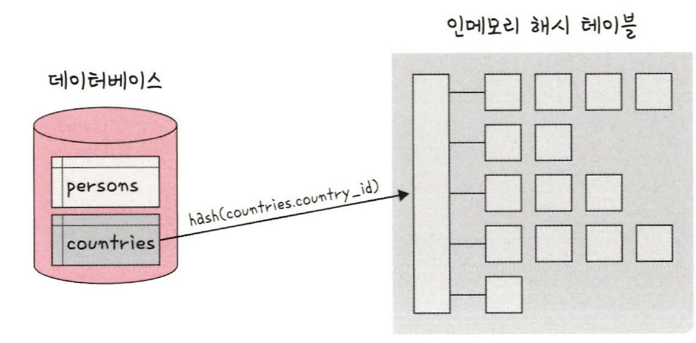
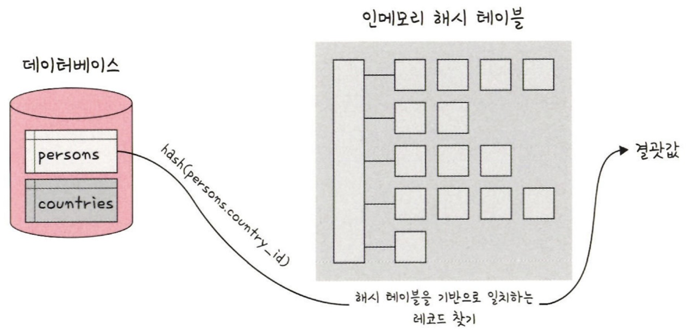

# 4장 데이터베이스

# 4.1 데이터베이스의 기본

데이터베이스는 일정한 규칙, 혹은 규약을 통해 구조화되어 저장되는 데이터의 모음

해당 데이터베이스를 제어, 관리하는 통합 시스템을 DBMS(DataBase Management System)

데이터베이스 안에 있는 데이터들은 특정 DBMS마다 정의된 쿼리 언어(Query Language)를 통해 CRUD 수행

데이터베이스는 실시간 접근과 동시 공유가 가능



Django - DBMS(SQLite) - 데이터베이스

## 4.1.1 엔터티(entity)

- 사람, 장소, 물건 등 여러 개의 속성을 지닌 명사를 의미
- 예) 회원 : 이름, 아이디, 주소, 전화번호의 속성을 가짐
- 예) 주소라는 속성이 서비스의 요구 사항과 무관한 속성이라면 주소라는 속성은 사라짐

### 약한 엔터티와 강한 엔터티

- 예) A가 혼자서는 존재하지 못하고 B의 존재 여부에 따라 종속적이다
    
    ⇒ A : 약한 엔터티, B : 강한 엔터티
    

## 4.1.2 릴레이션(relation)

- 정보를 구분하여 저장하는 기본 단위
- 엔터티에 관한 데이터를 데이터베이스는 릴레이션 하나에 담아서 관리
    
    
    
    - 회원이라는 엔터티가 데이터베이스에서 관리될 때 릴레이션으로 변화된 것을 확인
    - 릴레이션은 관계형 데이터베이스에서는 ‘테이블’이라 함
    - NoSQL에서는 ‘컬렉션’

### 테이블과 컬렉션

데이터베이스 종류 : 관계형 데이터베이스, NoSQL 데이터베이스로 구분

대표적인 관계형 데이터베이스 : MySQL

- 레코드 - 테이블 - 데이터베이스로 구성

대표적인 NoSQL 데이터베이스 : MongoDB

- 도큐먼트 - 컬렉션 - 데이터베이르로 구성


위 그림처럼 레코드가 쌓여 테이블이 되고, 테이블이 쌓여 데이터베이스가 됨

## 4.1.3 속성(attribute)

- 릴레이션에서 관리하는 구체적이며 고유한 이름을 갖는 정보
- 예) ‘차’ 라는 엔터티의 속성 : 차 번호, 바퀴 수, 차 색깔, 차종 등
    - 이 중 서비스의 요구사항을 기반으로 관리해야 할 필요가 있는 속성들만 엔터티의 속성이 됨

### 4.1.4 도메인(domain)

- 릴레이션에 포함된 각각의 속성들이 가질 수 있는 값의 집합
- 예) 성별이라는 속성이 있다면 이 속성이 가질 수 있는 값 : {남, 여}
    
    
    
    - 회원이라는 릴레이션에 이름, 아이디, 주소, 전화번호, 성별이라는 속성 존재
    - 성별은 {남, 여} 라는 도메인을 가짐

## 4.1.5 필드와 레코드

위 설명들을 기반으로 데이터베이스에서 필드와 레코드로 구성된 테이블을 만들 수 있음


- 회원이란 엔터티는 member라는 테이블로 속성인 이름, 아이디 등을 가지고 있으며, name, ID, address 등의 필드를 가짐. 그리고 이 테이블에 쌓이는 행(row) 단위의 데이터: `**레코드** 또는 **튜플**`
- 예) ‘책’이라는 엔터티를 정의하고 이를 기반으로 테이블을 만듬.
    - 속성 : 이름, 저자의 아이디, 출판 년도, 장르, 생성 일시, 업데이트 일시만 있다고 가정
    - 책의 아이디 : INT
    - 책의 제목 : VARCHAR(255)
    - 책의 저자 아이디 : INT
    - 책의 출판년도 : VARCHAR(255)
    - 책의 장르 : VARCHA(255)
    - 생성 일시 : DATETIME
    - 업데이트 일시 : DATETIME
    
    
    

### 필드 타입

필드는 타입을 가짐. 예를들어 이름 : 문자열, 전화번호 : 숫자

**숫자 타입**


**날짜 타입**

DATE, DATETIME, TIMESTAMP 등

- DATE
    - 날짜부분은 있지만 시간 부분은 없는 값
    - 1000-01-01 ~ 9999-12-31
- DATETIME
    - 날짜 및 시간 부분을 모두 포함하는 값
    - 1000-01-01 00:00:00 ~ 9999-12-31 23:59:59
- TIMESTAMP
    - 날짜 및 시간 부분을 모두 포함하는하는 값에 사용됨
    - 1970-01-01 00:00:01 ~ 2038-01-19 03:14:07

**문자 타입**

CHAR, VARCHAR, TEXT, BLOB, ENUM, SET

- CHAR, VARCHAR
    - 그 안에 수를 입력해서 몇자까지 입력할 지 정함
    - CHAR : 테이블을 생성할 때 선언한 길이로 **고정**
        - 0 ~ 255
    - VARCHAR : 가변 길이 문자열
        - 0 ~ 65535
- TEXT, BLOB
    - TEXT : 큰 문자열, 주로 게시판의 본문을 저장할 때 사용
    - BLOB : 이미지, 동영상 등 큰 데이터 저장에 사용
        - 보통 아마존의 이미지 호스팅 서비스인 S3를 이용하는 등 서버에 파일을 올리고, 파일에 관한 경로를 VARCHAR로 저장
- ENUM, SET
    - 모두 문자열을 열거한 타입
    - ENUM
        - x-small, small, medium, large, x-large 형태로 사용
        - 이 중 하나만 선택하는 단일 선택만 가능
        - ENUM 리스트에 없는 잘못된 값을 삽입하면 빈 문자열이 대신 삽입됨.
        - ENUM을 이용하면 x-small 등이 0, 1 등으로 매핑되어 메모리를 적게 사용하는 이점
        - 최대 65535개의 요소를 넣을 수 있음
    - SET
        - ENUM과 비슷하지만 여러 개의 데이터를 선택할 수 있고, 비트단위 연산을 할 수 있음
        - 최대 64개의 요소를 집어넣을 수 있음

## 4.1.6 관계


### 1 : 1 관계


### 1 : N 관계


### N : M 관계


## 4.1.7 키

테이블 간의 관계를 조금 더 명확하게 하고 테이블 자체의 인덱스를 위해 설정된 장치로 기본키, 외래키, 후보키, 슈퍼키, 대체키가 있음


### 기본키(Primary Key : PK)

- 유일성과 최소성을 만족하는 키
    
    
    
    - 중복되어서는 안됨

**자연키**

- 중복되는 값들을 제외하며 중복되지 않는 것을 자연스럽게 뽑다가 나오는 키

**인조키**

- 인위적으로 아이디를 부여하고, 이를 통해 고유 식별자를 생성

### 외래키(Foreign Key : FK)

- 다른 테이블의 기본키를 그대로 참조하는 값
- 개체와의 관계를 식별하는 데 사용
    
    
    
- 외래키는 중복 가능

### 후보키(candidate key)

- 기본키가 될 수 있는 후보들이며 유일성과 최소성을 동시에 만족하는 키

### 대체키(alternate key)

- 후보키가 두 개 이상일 경우 어느 하나를 기본키로 지정하고 남은 후보 키들을 말함

### 슈퍼키(super key)

- 각 레코드를 유일하게 식별할 수 있는 유일성을 갖춘 키

---

# 4.2 ERD와 정규화 과정

ERD(Entity Relationship Diagram) : 데이터베이스를 구축할 때 가장 기초적인 뼈대 역할, 릴레이션 간의 관계들을 정의한 것

## 4.2.1 ERD의 중요성

- ERD는 시스템의 요구 사항을 기반으로 작성, 이 ERD를 기반으로 데이터베이스를 구축
- 데이터베이스를 구축한 이후에도 디버깅 또는 비즈니스 프로세스 재설계가 필요한 경우에 설계도 역할을 담당하기도 함
- ERD는 관계형 구조로 표현할 수 있는 데이터를 구성하는 데 유용할 순 있지만 비정형 데이터를 충분히 표현할 수 없다는 단점

## 4.2.2 예제로 배우는 ERD


## 4.2.3 정규화 과정

정규화 과정은 릴레이션 간의 잘못된 종속 관계로 인해 데이터베이스 이상현상이 일어나서 이를 해결하거나, 저장공간을 효율적으로 사용하기 위해 릴레이션을 여러 개로 분리하는 과정

데이터베이스 이상현상

- 회원이 한 개의 등급을 가져야 하는데 세 개의 등급을 갖거나 삭제할 때 필요한 데이터가 같이 삭제되고, 데이터를 삽입해야 하는데 하나의 필드값이 NULL이 되면 안되어서 삽입하기 어려운 현상

정규화 과정

- 정규형 원칙을 기반으로 정규형을 만들어가는 과정, 정규화된 정도는 정규형(NF, Normal Form)으로 표현
- 기본 정규형인 제 1 정규형, 제 2 정규형, 제 3 정규형, 보이스/코드 정규형이 있음
- 고급 정규형인 제 4 정규형, 제 5 정규형이 존재

### 정규형 원칙

같은 의미를 표현하는 릴레이션이지만 좀 더 좋은 구조로 만들어야 하고, 자료의 중복성은 감소해야 하며, 독립적인 관계는 별개의 릴레이션으로 표현해야 하며, 각각의 릴레이션은 독립적인 표현이 가능해야 하는 것을 말함

> `수업 내용`
> 
> 
> ### 테이블은 왜 나눌까?
> 
> - 데이터베이스, DBMS, SQL, . . .
> - 결국 테이블에 CRUD 하는 것!
> 
> ### 데이터베이스 정규형
> 
> - 데이터베이스를 구조화 하는 방법론
> - 데이터의 중복을 최소화하고 일관성과 무결성을 보장하기 위함
> - 데이터 구조를 더 좋은 구조로 바꾸는 것을 정규화라고 함
> - 관계형 데이터베이스의 경우 6개의 정규형 존재
> 
> ### 제 1 정규형
> 
> - 하나의 속성값이 복수형을 가지면 안됨!
> - 하나의 속성에는 값이 하나만 들어가야 한다는 소리
>     
>     
>     
>     필라테스가 좋다는걸 들은 민서가 상담을 끝내고 결제 대기중이라면?
>     
>     
>     
>     
>     
> 
> ### 제 2 정규형
> 
> - 테이블의 기본키에 종속되지 않는 컬럼은 테이블이 분리 되어야 함
> - 테이블과 관련 없는 애들은 따로 분리하는 것
> - 키가 아닌 속성이 기본 키의 일부분에 종속 되는 것
> - 테이블에서 부분 함수적 종속성을 제거한 것
>     
>     
>     
>     여기서 만약 눈치를 보던 수영이 가격을 올린다면?
>     
>     
>     
>     지금은 한 개의 데이터지만 회원이 몇 천명이 된다면 전부 수정 필요!
>     
>     
>     
>     
>     
> 
> ### 제 3 정규형
> 
> - 다른 속성에 의존(종속)하는 속성은 따로 분리할 것
>     
>     
>     
>     
>     
>     - PK 인 운동명과 아무 상관이 없음
>     - 강사 속성에 종속된 속성
>     
>     
>     

### 보이스 / 코드 정규형(BCNF)

제 3 정규형, 결정자가 후보키가 아닌 함수 종속 관계를 제거하여 릴레이션의 함수 종속 관계에서 모든 결정자가 후보키인 상태

```python
결정자 : 함수 종속 관계에서 특정 종속자(dependent)를 결정짓는 요소
					X -> Y 일 때 X는 결정자, Y는 종속자
```

# 4.3 트랜잭션과 무결성

## 4.3.1 트랜잭션

- 데이터베이스에서 하나의 논리적 기능을 수행하기 위한 작업의 단위
- 데이터베이스에 접근하는 방법은 쿼리 이므로, 여러 개의 쿼리들을 하나로 묶는 단위
- 특징 : 원자성, 일관성, 독립성, 지속성 : ACID 특징

### 원자성(atomicity)

`all or nothing`

- 트랜잭션과 관련된 일이 모두 수행되었거나 되지 않았거나를 보장하는 특징
- 예) 트랜잭션을 커밋했는데, 문제가 생겨 롤백하면 그 이후에 모두 수행되지 않음을 보장하는 것
- 트랜잭션 단위로 여러 로직들을 묶을 때 외부 API를 호출하는 것이 있으면 안됌
    - 만약 있다면 롤백이 일어났을 때 어떻게 해야 할 것인지에 대한 해결 방법이 있어야 하고 트랜잭션 전파를 신경써서 관리해야 함

**커밋과 롤백**

커밋(commit)

- 여러 쿼리가 성공적으로 처리되었다고 확정하는 명령어
- 트랜잭션 단위로 수행되며, 변경된 내용이 모두 영구적으로 저장되는 것
- “커밋이 수행되었다” == “하나의 트랜잭션이 성공적으로 수행되었다”
    
    
    
    - Update,Insert, Delete의 쿼리가 하나의 트랜잭션 단위로 수행, 이후 데이터베이스에 영구 저장됨
    
    
    

롤백

- 트랜잭션으로 처리한 하나의 묶음 과정을 일어나기 전으로 돌리는 일(취소)를 말함
- 하나의 에러나 이슈 때문에 트랜잭션 전으로 돌려야 하면 롤백을 사용

커밋과 롤백 덕에 데이터 무결성 보장

또한 데이터 변경 전에 변경 사항을 쉽게 확인할 수 있고 해당 작업을 그룹화할 수 있음

**트랜잭션 전파**

트랜잭션을 수행할 때 커넥션 단위로 수행하기 때문에 커넥션 객체를 넘겨서 수행해야 함 : 매번 넘겨주기 어렵고 귀찮음

트랜잭션 전파 : 이를 넘겨서 수행하지 않고 여러 트랜잭션 관련 메서드의 호출을 하나의 트랜잭션에 묶에도록 하는 것

### 일관성(consistency)

- ‘허용된 방식’ 으로만 데이터를 변경해야 하는 것
- 데이터베이스에 기록된 모든 데이터는 여러 조건, 규칙에 따라 유효함을 가져야 함

### 격리성(isolation)

- 트랜잭션 수행 시 서로 끼어들지 못하는 것
- 복수의 병렬 트랜잭션은 서로 격리되어 마치 순차적으로 실행되는 것처럼 작동되어야 하고, 데이터베이스는 여러 사용자가 같은 데이터에 접근할 수 있어야 함 → 그냥 순차적으로 하면 쉽지만 그렇게 하면 성능이 나빠짐
- 격리성은 여러 개의 격리 수준으로 나뉘어 격리성을 보장함
    
    
    
- 격리 수준은 SERIALIZABLE, REPEATABLE_READ, READ_COMMITTED, READ_UNCOMMITTED가 있음
- 위로 갈수록 동시성이 강해지지만 격리성은 약해짐
- 아래로 갈수록 동시성은 약해지고 격리성은 강해짐
- 각 단계마다 나타나는 현상
    - REPEATABLE_READ
        - 팬텀 리드
    - READ_COMMITTED
        - 팬텀 리드, 반복 가능하지 않은 조회 발생
    - READ_UNCOMMITTED
        - 팬텀리드, 반복 가능하지 않은 조회, 더티 리드 발생 가능

```markdown
격리 수준에 따라 발생하는 현상
- 팬텀 리드
- 반복 가능하지 않은 조회
- 더티 리드
```

**팬텀 리드(phantom read)**

- 한 트랜잭션 내에서 동일한 쿼리를 보냈을 때 해당 조회 결과가 다른 경우
- 예) A가회원 테이블에서 age가 12 이상인 쿼리 보냈을 때 이 결과로 세 개의 테이블이 조회, 그 다음 B가 age가 15인 회원 레코드를 삽입 → 세 개가 아닌 네 개의 테이블이 조회됨**(이게 뭔소리야 왜 네개야 갑자기)**

**반복 가능하지 않은 조회(non-repeatable read)**

- 한 트랜잭션 내의 같은 행에 두 번 이상 조회가 발생했는데, 그 값이 다른 경우
- 예) A가 큰돌의 보석 개수가 100개라는 값을 가진 데이터였는데, 그 이후 사용자 B가 그 값을 1로 변경해서 커밋했다고 하면 사용자 A는 100이 아닌 1을 읽게 됨
- 팬텀리드와 다른 점은 반복 가능하지 않은 조회는 행 값이 달라질 수도 있는데, 팬텀 리드는 다른 행이 선택될 수도 있다는 것을 의미함

**더티 리드(dirty read)**

- 반복ㄱ가능하지 않은 조회와 유사, 한 트랜잭션이 실행중일 때 다른 트랜잭션에 의해 수정되었지만 아직 ‘커밋되지 않은‘ 행의 데이터를 읽을 수 있을 때 발생
- 예) A가 큰돌의 보석 개수 100을 1로 변경한 내용이 ’커밋되지 않은‘ 상태라도 그 이후 사용자 B가 조회한 결과가 1로 나오는 경우를 말함
    
    ---
    

**격리 수준**

- `SERIALIZABLE`
    - 말 그대로 트랜잭션을 순차적으로 진행 시키는 것
    - 여러 트랜잭션이 동시에 같은 행에 접근 불가능
    - 매우 엄격한 수준이므로 해당 행에 대해 격리시키고, 이후 트랜잭션이 이 행에 대해 일어난다면 기다려야 함
    - 교착상태가 일어날 확률도 많고 가장 성능이 떨어지는 격리 수준
- `REPEATABLE_READ`
    - 하나의 트랜잭션이 수정한 행을 다른 트랜잭션이 수정할 수 없도록 막아주지만 새로운 행을 추가하는 것은 막지 않음
    - 이후에 추가된 행이 발견될 수도 있음
- `READ_COMMITTED`
    - 가장 많이 사용되는 격리수준
    - READ_UNCOMMITTED와 달리 다른 트랜잭션이 커밋하지 않은 정보는 읽을 수 없음 → 커밋 완료된 데이터에 대해서만 조회를 허용
    - 어떤 트랜잭션이 접근한 행을 다른 트랜잭션이 수정할 수 있음
    - 예) 트랜잭션 A가 수정한 행을 틀랜잭션 B가 수정할 수도 있음 ⇒ A가 같은 행을 다시 읽을 때 다른 내용이 발견될 수 있음
- `READ_UNCOMMITTED`
    - 가장 낮은 격리 수준, 하나의 트랜잭션이 커밋되기 이전에 다른 트랜잭션에 노출되는 문제가 있지만 가장 빠름
    - 데이터 무결성을 위해 되도록이면 사용하지 않는 것이 이상적이지만, 몇몇 행이 제대로 조회되지 않더라도 괜찮은 거대한 양의 데이터를 ‘어림잡아’ 집계하는 데 주로 사용

### 지속성(Durability)

- 성공적으로 수행된 트랜잭션은 영원히 반영되어야 하는 것을 의미
- 데이터베이스에 시스템 장애가 발생해도 원래 상태로 복구하는 회복 기능이 있어야 함을 뜻함
- 이를 위해 `체크섬, 저널링, 롤백` 등의 기능 제공
    
    ```markdown
    체크섬
    - 중복 검사의 한 형태, 오류 정정을 통해 송신된 자료의 무결성을 보호하는 단순한 방법
    저널링
    - 파일 시스템 또는 데이터베이스 시스템에 변경사항을 반영(commit)하기 전에로깅하는 것
    - 트랜잭션 등 변경 사항에 대한 로그를 남기는 것
    ```
    

## 4.3.2 무결성

- 데이터의 정확성, 일관성, 유효성을 유지하는 것
- 무결성이 유지되어야 데이터베이스에 저장된 데이터 값과 그 값에 해당하는 현실 세계의 실제 값이 일치하는지에 대한 신뢰가 생김
- 무결성의 종류
    
    
    | 개체 무결성 | 기본키로 선택된 필드는 빈 값을 허용하지 않음 |
    | --- | --- |
    | 참조 무결성 | 서로 참조 관계에 있는 두 테이블의 데이터는 항상 일관된 값을 유지해야 함 |
    | 고유 무결성 | 특정 속성에 대해 고유한 값을 가지도록 조건이 주어진 경우 그 속성 값은 모두 고유한 값을 가짐 |
    | NULL 무결성 | 특정 속성 값에 NULL이 올 수 없다는 조건이 주어진 경우 그 속성값은 NULL이 될 수 없다는 제약 조건 |

---

# 4.4 데이터베이스의 종류

## 4.4.1 관계형 데이터베이스(RDBMS)

- 행과 열을 가지는 표 형식 데이터를 저장하는 형태의 데이터베이스
- SQL이라는 언어를 써서 조작
- MySQL, PostgreSQL, 오라클, SQL Server, MSSQL 등

### MySQL

- C, C++로 만들어졌으며 MyISAM 인덱스 압축 기술, B-트리 기반 인덱스, 스레드 기반 메모리 할당 시스템, 매우 빠른 조인, 최대 64개의 인덱스 제공
- 대용량 데이터베이스를 위해 설계, 록백, 커밋, 이중 암호 지원 보안 등의 기능을 제공하며 많은 서비스에서 사용
    
    
    
- 데이터베이스의 심장과 같은 역할을 하는 곳이 바로 스토리지 엔진, 모듈식 아키텍처로 쉽게 스토리지 엔진을 바꿀 수 있으며 데이터 웨어하우징, 트랜잭션 처리, 고가용성 처리에 강점
- 스토리지 엔진 위에는 커넥터 API 및 서비스 계층을 통해 MySQL 데이터베이스와 쉽게 상호작용 가능
- 쿼리 캐시를 지원해서 입력된 쿼리 문에 대한 전체 결과 집합을 저장
    
    → 사용자가 작성한 쿼리가 캐시에 있는 쿼리와 동일하다면 서버는 단순히 구문 분석, 최적화 및 실행을 건너뛰고 캐시의 출력만 표시함
    

### PostgreSQL

- 디스크조각이 차지하는 영역을 회수할 수 있는 장치인 VACUUM이 특징
- 최대 테이블의 크기는 32TB
- SQL 뿐만 아니라 JSON을 이용해서 데이터에 접근 가능
- 지정 시간에 복구하는 기능, 로깅, 접근 제어, 중첩된 트랜잭션, 백업 등을 할 수 있음

## 4.4.2 NoSQL 데이터베이스

- Not only SQL이라는 슬로건에서 생겨난 데이터베이스
- SQL을 사용하지 않은 데이터베이스를 말하며, 대표적으로 MongoDB, redis 등

### MongoDB

- JSON을 통해 데이터에 접근할 수 있고, Binary JSON형태(BSON)로 데이터가 저장되어 와이어드타이거 엔진이 기본 스토리지 엔진으로 장착된 키 - 값 데이터 모델에서 확장된 도큐먼트 기반의 데이터베이스
- 확장성이 뛰어남, 빅데이터를 저장할 때 성능이 좋음
- 고가용성, 샤딩, 레플리카셋을 지원
- 스키마를 정해놓지 않고 데이터를 삽입할 수 있기 때문에 다양한 도메인의 데이터베이스를 기반으로 분석하거나 로깅 등을 구현할 때 강점을 보임
- MongoDB는도큐먼트를 생성할 때마다 다른 컬렉션에서 중복된 값을 지니기 힘든 유니크한 값인 ObjectID가 생성
    
    
    
- 이는 기본키로 유닉스 시간 기반의 타임스탬프(4바이트), 랜덤값(5바이트), 카운터(3바이트)로 이루어져 있음

### redis

- 인메모리 데이터베이스이자 키 - 값 데이터 모델 기반의 데이터베이스
- 기본적인 데이터 타입은 문자열(string), 최대512MB까지저장 가능
- 이외에 셋(set),해시(hash) 등을 지원
- pub/sub 기능을 통해 채팅 시스템, 다른 데이터베이스 앞단에 두어 사용하는 캐싱 계층, 단순한 키 - 값이 필요한 세션 정보 관리, 정렬된 셋(sorted set)자료구조를 이요한 실시간 순위표 서비스에 사용

# 4.5 인덱스

## 4.5.1 인덱스의 필요성

- 인덱스는 데이터를 빠르게 찾을 수 있는 하나의 장치
- 예) 책 마지막장에 있는 찾아보기

## 4.5.2 B-트리

- 인덱스는 보통 B-트리라는 자료구조로 구성. 이는 루트 노드, 리프 노드, 그리고 루트노드와 리프노드 사이에 있는 브랜치 노드로 나뉨
    
    
    
    예) E를 찾는다고 하면 전체 테이블을 탐색하는 것이 아니라 E가 있을법한 리프노드로 들어가서 E를 탐색하면 쉽게 찾을 수 있음
    
    이 자료구조 없이 탐색 시 A, B, C, D, E 다섯번이지만, 이렇게 노드들로 나누면 두 번만에 리프노드에서 찾을 수 있음
    
    
    
    트리 탐색은 맨 위 루트노드부터 탐색이 일어나며 브랜치 노드를 거쳐 리프노드까지 내려옴
    
    57보다 같거나 클 때까지 `<=`를 기반으로 처음 루트 노드에서 39, 83 이후 아래 노드로 내려와 46, 53, 57 등 정렬된 값을 기반으로 탐색함
    
    이렇게 루트 노드부터 시작하여 마지막 리프노드에 도달해서 57이 가리키는 데이터 포인터를 통해 결괏값을 반환함
    

### 인덱스가 효율적인 이유와 대수확장성

- 인덱스가 효율적인 이유
    - 효율적인 단계를 거쳐 모든 요소에 접근할 수 있는 균형잡힌 트리 구조와 트리 깊이의 대수확장성 때문
- 대수확장성
    - 트리 깊이가 리프 노드 수에 비해 매우 느리게 성장하는 것
    - 기본적으로 인덱스가 한 깊이씩 증가할 때마다 최대 인덱스 항목의 수는 4배씩 증가함

## 4.5.3 인덱스 만드는 방법

### MySQL

- 클러스터형 인덱스와 세컨더리 인덱스가 있으며, 클러스터형 인덱스는 테이블당 하나를 설정할 수 있음
- PK 옵션으로 기본키로 만들면 클러스터형 인덱스 생성 가능
- 기본키로 만들지 않고 unique not null 옵션을 붙이면 클러스터형 인덱스로 만들 수 있음
- create index…명령어를 기반으로 만들면 세컨더리 인덱스를 만들 수 있음
- 하나의 인덱스만 생성할 것이라면 클러스터형 인덱스를 만드는 것이 세컨더리 인덱스를 만드는 것보다 성능이 좋다
- 세컨더리 인덱스는 보조 인덱스로 여러 개의 필드 값을 기반으로 쿼리르 많이 보낼 때 생성해야 하는 인덱스
- 예) age라는 하나의 필드 만으로 쿼리를 보낸다면 크러스터형 인덱스만 필요. 하지만 age,name, email 등 다양한 필드를 기반으로 쿼리를 보낼 때는 세컨더리 인덱스를 사용해야 함

### MongoDB

- 도큐먼트를 만들면 자동으로 ObjectID가 형성, 해당 키가 기본키로 설정
- 세컨더리키도 부가적으로 설정해서 기본키와 세컨더리키를 같이 쓰는 복합 인덱스 설정 가능

## 4.5.4 인덱스 최적화 기법

인덱스 최적화 기법은 데이터베이스마다 다름 - MongoDB기반

### 1. 인덱스는 비용이다

- 인덱스는 두 번 탐색하도록 강요한다
    - 인덱스 리스트, 그 다음 컬렉션 순으로 탐색하기 때문이며, 관련 읽기 비용이 듬
- 컬렉션이 수정되었을 때 인덱스도 수정되어야 함
    - 마치 책의 본문이 수정되었을 때 목차나 찾아보기도 수정함
    - 이 때, B트리의 높이를 균형있게 조절하는 비용도 들고, 데이터를 효율적으로 조회할 수 있도록 분산시키는 비용도 듬
    - 따라서 쿼리에 있는 필드에 인덱스를 무작정 다 설정하는 것은 정답이 아님
    - 또한, 컬렉션에서 가져와야 하는 양이 많을수록 인덱스를 사용하는 것은 비효율적

### 2. 항상 테스팅 하라

- 인덱스 최적화 기법은 서비스 특징에 따라 달라짐
    - 서비스에서 사용하는 객체의 깊이, 테이블의 양 등이 다름
    - 따라서 항상 테스팅하는 것이 중요
    - explain() 함수를 통해 인덱스를 만들고 쿼리를 보낸 이후에 테스팅을 하며 걸리는 시간을 최소화 해야함
    - 참고) MySQL
        
        ```markdown
        EXPLAIN
        SELECT * FROM t1
        JOIN t2 ON t1, c1 = t2, c1
        ```
        

### 3. 복합 인덱스는 같음, 정렬, 다중 값, 카디널리티 순이다

- 보통 여러 필드를 기반으로 조회를 할 때 복합 인덱스를 생성
    - 이 인덱스를 생성할 때는 순서가 있고 생성 순서에 따라 인덱스 성능이 달라짐
    - 같음, 정렬, 다중 값, 카디널리티 순으로 생성
1. 어떠한 값과 같음을 비교하는 `==` 이나 equal이라는 쿼리가 있다면 제일 먼저 인덱스로 설정
2. 정렬에 쓰는 필드라면 그 다음 인덱스로 설정
3. 다중 값을 출력해야 하는 필드, 즉 쿼리 자체가 `>` 이나 `<` 등 많은 값을 출력해야 하는 쿼리에 쓰는 필드라면 나중에 인덱스를 설정함
4. 유니크한 값의 정도를 카디널리티라고 함
    - 이 카디널리티가 높은 순서를 기반으로 인덱스를 생성해야 함
    - 예) age, email
        - email이라는 필드가 카디널리티가 더 높기 때문에 email이라는필드에 대한 인덱스를 먼저 생성 해야 함

# 4.6 조인의 종류

조인(join)

- 하나의 테이블이 아닌 두 개 이상의 테이블을 묶어서 하나의 결과물을 만드는 것
- MySQL에서는 JOIN 이라는 쿼리, MongoDB에서는 lookup이라는 쿼리로 이를 처리함
- 조인의 종류 중 대표적인 내부 조인, 왼쪽 조인, 오른쪽 조인, 합집합 조인이 있음



- 내부조인(inner join)
    - 왼쪽 테이블과 오른쪽 테이블의 두 행이 모두 일치하는 행이 있는 부분만 표기
- 왼쪽 조인(left outer join)
    - 왼쪽 테이블의 모든 행이 결과 테이블에 표기
- 오른쪽 조인(right outer join)
    - 오른쪽 테이블의 모든 행이 결과 테이블에 표기
- 합집합 조인(full outer join)
    - 두 개의 테이블을 기반으로 조인 조건에 만족하지 않는 행까지 모두 표기

## 4.6.1 내부 조인

- 내부 조인은 두 테이블 간에 교집합을 나타냄

```sql
SELECT * FROM TableA A
INNER JOIN TableB B ON
A.key = B.key
```

## 4.6.2 왼쪽 조인

- 테이블 B의 일치하는 부분의 레코드와 함께 테이블 A를 기준으로 완전한 레코드 집합을 생성
- 테이블 B에 일치하는 항목이 없으면 해당 값은 null

```sql
SELECT * FROM TableA A
LEFT JOIN TableB B ON
A.key = B.key
```

## 4.6.3 오른쪽 조인

- 테이블 A에서 일치하는 부분의 레코드와 함께 테이블 B를 기준으로 완전한 레코드 집합을 생성
- 테이블 A에 일치하는 항목이 없으면 해당 값은 null

```sql
SELECT * FROM TableA A
RIGHT JOIN TableB B ON
A.key = B.key
```

## 4.6.4 합집합 조인

- 양쪽 테이블에서 일치하는 레코드와 함께 테이블 A와 테이블 B의 모든 레코드 집합을 생성
- 일치하는 항목이 없으면 누락된 쪽에 null값이포함되어 출력됨

```sql
SELECT * FROM TableA A
FULL OUTER JOIN TableB B ON
A.key = B.key
```

# 4.7 조인의원리

## 4.7.1 중첩 루프 조인(NLJ, Nested Loop Join)

- 중첩 for문과 같은 원리로 조건에 맞는 조인을 하는 방법
- 랜덤 접근에 대한 비용이 많이 증가하므로 대용량의 테이블에서는 사용하지 않음
- 예)“t1, t2 테이블을 조인한다”
    - 첫 번째 테이블에서 행을 한번에 하나씩 읽고 그다음 테이블에서도 행을 하나씩 읽어 조건에 맞는 레코드를 찾아 결괏값을 반환함
    
    ```sql
    for each row in t1 matching reference key{
    	for each row in t2 matching reference Key{
    		if row satisfies join conditions, send to client
    	}
    }
    ```
    

## 4.7.2 정렬 병합 조인

- 각각의 테이블을 조인할 필드 기준으로 정렬하고 정렬이 끝난 이후에 조인 작업을 수행하는 조인
- 조인할 때 쓸 적절한 인덱스가 없고 대용량의 테이블들을 조인하고 조인 조건으로 `<, >` 등 범위 비교 연산자가 있을 때 씀

## 4.7.3 해시 조인

- 해시 테이블을 기반으로 조인하는 방법
- 두 개의 테이블을 조인한다고 가정, 하나의 테이블이 메모리에 온전히 들어간다면 보통 중첩 루프 조인보다 더 효율적임
- 동등(`=`) 조인에서만 사용 가능

**Mysql의 해시 조인 단계**

### 빌드 단계

- 입력 테이블 중 하나를 기반으로 메모리 내 해시 테이블을 빌드하는 단계
- 예) persons와 countries라는 테이블을 조인한다고 가정
    - 둘 중 바이트가 더 작은 테이블을 기반으로 해서 테이블을 빌드
    
    
    
    - 조인에 사용되는 필드가 해시 테이블의 키로 사용됨
    - ‘countries.country_id’가 키로 사용됨

### 프로브 단계

- 프로브 단계 동안 레코드 읽기를 시작
- 각 레코드에서 ’persons.country_id’에 일치하는 레코드를 찾아서 결괏값으로 반환
    
    
    
- 이를통해 각 테이블은 한 번씩만 읽게 되어 중첩해서 두 개의 테이블을 읽는 중첩 루프 조인보다 보통은 성능이 더 좋음
- 사용 가능한 메모리 양은 시스템 변수 join_buffer_size에 의해 제어, 런타임 시 조정 가능